:reveal_properties: 
#+reveal_root:                     https://cdn.jsdelivr.net/npm/reveal.js
#+reveal_reveal_js_version:        4
#+reveal_theme:                    black
#+reveal_trans:                    Linear
#+reveal_extra_css:         
#+reveal_hlevel:                   1
#+reveal_slide_footer:             
#+reveal_title_slide:              <h2>%t</h2> <h4>%s</h4>   <h6>%a</h6>   <h6>%d</h6>
#+reveal_title_slide_background:   #FFFFFF
#+reveal_plugins:                  (notes highlight math)
#+reveal_init_options:             slideNumber:true
#+options:                         toc:nil num:nil timestamp:nil
:end:

#+title: Treezer Goode
#+subtitle: The Curious Tale of a Wood that Needed the Trees
#+author: Thomas P. Harte
#+email: tharte@cantab.net
#+date: Saturday, 2022-06-04

* 
:PROPERTIES:
:REVEAL_EXTRA_ATTR: data-auto-animate
:END:

#+BEGIN_NOTES
- usually I speak about things like this (equations)
- but today we'll be speaking about things like this (CLIs)
#+END_NOTES

#+ATTR_REVEAL: :data_id equations-cli
\begin{equation*}
A =  
\min\left(1, {\tilde\pi(\theta')\,q(\theta^{(t)}\mid\theta') \over 
    \tilde\pi(\theta^{(t)})\,q(\theta'\mid\theta^{(t)})} \right)
\end{equation*}

* 
:PROPERTIES:
:REVEAL_EXTRA_ATTR: data-auto-animate
:END:

#+BEGIN_NOTES
- anyone work for MS?
- anyone work for a large organization with lots of legacy systems?
- turns out CLIs are quite handy
#+END_NOTES

#+ATTR_REVEAL: :data_id equations-cli
#+begin_src bash :eval no
cmd spark start cluster --instance=instance-1 --quietly
#+end_src

* 
:PROPERTIES:
:REVEAL_EXTRA_ATTR: data-auto-animate
:END:

#+BEGIN_NOTES
- MS: global content
- AFS
- point? everything looks the same
#+END_NOTES

#+ATTR_REVEAL: :data_id equations-cli
#+begin_src bash :eval no
/ms/dist/python/PROJ/bin/python
#+end_src

* 
:PROPERTIES:
:REVEAL_EXTRA_ATTR: data-auto-animate
:END:

#+BEGIN_NOTES
- MS: global content
- AFS
- point? everything looks the same
#+END_NOTES

#+ATTR_REVEAL: :data_id equations-cli
#+begin_src bash :eval no
/ms/dist/R/PROJ/bin/R
#+end_src

* 
:PROPERTIES:
:REVEAL_EXTRA_ATTR: data-auto-animate
:END:

#+BEGIN_NOTES
- anyone work for MS?
- anyone work for a large organization with lots of legacy systems?
- turns out CLIs are quite handy
#+END_NOTES

#+ATTR_REVEAL: :data_id equations-cli
#+begin_src bash :eval no
cmd spark start cluster --instance=instance-1 --quietly
#+end_src

* Disclaimer
:PROPERTIES:
:reveal_background: #FFFFFF
:END:

** Disclaimer
:PROPERTIES:
:reveal_background: #FFFFFF
:END:

#+BEGIN_NOTES
- important things: I am /not/ an investment advisor
- less a case of my distancing myself from my employer, than
  it is the other way around\dots
- if you hurt yourself using the Content, well\dots
#+END_NOTES

#+begin_export html

<small>
Thomas P. Harte ("the Author") is providing this presentation and its
contents 
("the Content") for educational purposes only at the
<em>R in Finance Conference</em>, 
Chicago, IL (2022-06-04).
The Author is <em>not</em> a registered investment advisor and the Author
does not purport to offer investment advice nor business advice. The
opinions expressed in the Content are solely those of the Author, and do
not necessarily represent the opinions of the Author's employer, nor any
organization, committee or other group with which the Author is affiliated.
</small>

#+end_export

#+begin_export html

<small>
THE AUTHOR SPECIFICALLY DISCLAIMS ANY PERSONAL LIABILITY, LOSS OR RISK
INCURRED AS A CONSEQUENCE OF THE USE AND APPLICATION, EITHER DIRECTLY
OR INDIRECTLY, OF THE CONTENT. THE AUTHOR SPECIFICALLY DISCLAIMS ANY
REPRESENTATION, WHETHER EXPLICIT OR IMPLIED, THAT APPLYING THE CONTENT
WILL LEAD TO SIMILAR RESULTS IN A BUSINESS SETTING. THE RESULTS PRESENTED
IN THE CONTENT ARE NOT NECESSARILY TYPICAL AND SHOULD NOT DETERMINE
EXPECTATIONS OF FINANCIAL OR BUSINESS RESULTS.
</small>

#+end_export

* 
:PROPERTIES:
:REVEAL_EXTRA_ATTR: data-auto-animate
:END:

#+BEGIN_NOTES
- and now\dots
- ladies and gentlemen
- it is time for
#+END_NOTES

#+ATTR_REVEAL: :data_id noble
#+begin_export html
<h3> The Noble </h3>

<h3 class="fragment roll-in"> Command Line Interface </h3>
#+end_export
* 
:PROPERTIES:
:REVEAL_EXTRA_ATTR: data-auto-animate
:END:

#+ATTR_REVEAL: :data_id noble
#+begin_export html
<h3> Address to the Nation </h3>
<h3 class="fragment roll-in"> on </h3>
<h3 class="fragment roll-in"> The State of the CLI </h3>
#+end_export

** Depends on the OS/language
** But\dots
** A bit of a mess
#+BEGIN_NOTES
- depends on the language
- a pseudo-standard has emerged
- UNIX has helped---in particular DevOps
- major impetus comes from Python
- not surprising, as it's the "glue" language
#+END_NOTES
#+attr_html: :width 50% :align center

#+begin_export html

<small>
Jackson Pollock <em>Number 18</em> (1950)&mdash;oil and enamel on masonite 
Guggenheim Museum, New York
</small>

#+end_export

** Depends on the OS/language
#+BEGIN_NOTES
- GNU: original evolution, but now DevOps!
- we use Scala at work, some Java
- Ammonite shell---Haoyi Li
#+END_NOTES

#+attr_html: :width 75% :align center
#+attr_reveal: :frag (grow grow shrink shrink shrink highlight-red grow) :frag_idx (1 2 3 4 5 6 6)
- GNU
- Python
- Java
- Scala
- C++
- R?

** GNU
#+BEGIN_NOTES
- GNU: original evolution
- think of ~--help~---where did it come from?
- why not ~-help~?
#+END_NOTES

#+begin_export html
<pre><code class="bash" data-line-numbers="1|2|3"># a pseudo-standard
cmd --help
cmd --version
</code></pre>
#+end_export 

** GNU: Git
#+BEGIN_NOTES
- OBSERVATION:
  There is a language of options (a "DSL for CLI options", if you will) that we need to learn
- OBSERVATION:
  ~<command>~: this leads us to the idea of /subcommands/
#+END_NOTES
#+begin_src bash :session *bash* :eval no
git --help | head -5
#+end_src

#+begin_export html
<pre class="example">
usage: git [--version] [--help] [-C &lt;path&gt;] [-c &lt;name&gt;=&lt;value&gt;]
           [--exec-path[=&lt;path&gt;]] [--html-path] [--man-path] [--info-path]
           [-p | --paginate | -P | --no-pager] [--no-replace-objects] [--bare]
           [--git-dir=&lt;path&gt;] [--work-tree=&lt;path&gt;] [--namespace=&lt;name&gt;]
           &lt;command&gt; [&lt;args&gt;]
</pre>
#+end_export 

** Observation: DSL
#+BEGIN_NOTES
- Source:
  + https://opensource.com/article/20/2/domain-specific-languages#:~:text=A%20good%20example%20of%20a,HTML%20is%20on%20the%20web.
  + https://www.freecodecamp.org/news/javascript-is-turing-complete-explained-41a34287d263#.6t0b2w66p
- we posit that the DSL is important, because it ought to transcend any host language 
  to be useful (we want ~--help~ or ~-h~ and not ~-help~, as per Java, say)
- we posit that the host language is of lesser importance 
  (though here we're concerned with R, obvs)
#+END_NOTES
#+attr_reveal: :frag (grow shrink) 
- Domain-specific language ("DSL"): The language in which the DSL is written or presented
- Host language: The language in which the DSL is executed or processed

** GNU
#+BEGIN_NOTES
- typical sequence of commands with Git
#+END_NOTES

#+begin_export html
<pre><code class="bash" data-line-numbers="5|6-9"># a pseudo-standard
cmd --help
cmd --version

# subcommands
git init
git add
git commit -am
git log
</code></pre>
#+end_export 

** GNU
#+BEGIN_NOTES
- back to the help, this time in full
#+END_NOTES

#+begin_src bash :session *bash* :eval no
git --help 
#+end_src

#+begin_export html
<pre><code class="bash" data-line-numbers="-|12|15|31|25">
usage: git [--version] [--help] [-C <path>] [-c <name>=<value>]
           [--exec-path[=<path>]] [--html-path] [--man-path] [--info-path]
           [-p | --paginate | -P | --no-pager] [--no-replace-objects] [--bare]
           [--git-dir=<path>] [--work-tree=<path>] [--namespace=<name>]
           <command> [<args>]

These are common Git commands used in various situations:

start a working area (see also: git help tutorial)
   clone             Clone a repository into a new directory
   init              Create an empty Git repository or reinitialize an existing one

work on the current change (see also: git help everyday)
   add               Add file contents to the index
   mv                Move or rename a file, a directory, or a symlink
   restore           Restore working tree files
   rm                Remove files from the working tree and from the index
   sparse-checkout   Initialize and modify the sparse-checkout

examine the history and state (see also: git help revisions)
   bisect            Use binary search to find the commit that introduced a bug
   diff              Show changes between commits, commit and working tree, etc
   grep              Print lines matching a pattern
   log               Show commit logs
   show              Show various types of objects
   status            Show the working tree status

grow, mark and tweak your common history
   branch            List, create, or delete branches
   commit            Record changes to the repository
   merge             Join two or more development histories together
   rebase            Reapply commits on top of another base tip
   reset             Reset current HEAD to the specified state
   switch            Switch branches
   tag               Create, list, delete or verify a tag object signed with GPG

collaborate (see also: git help workflows)
   fetch             Download objects and refs from another repository
   pull              Fetch from and integrate with another repository or a local branch
   push              Update remote refs along with associated objects

'git help -a' and 'git help -g' list available subcommands and some
concept guides. See 'git help <command>' or 'git help <concept>'
to read about a specific subcommand or concept.
See 'git help git' for an overview of the system.
</code></pre>
#+end_export 

** GNU: Git subcommands
#+BEGIN_NOTES
- at this point we should recognize that we're repeating what
  we did for the ~git~ command itself
- OBSERVATION
- what is it called when the solution to a problem depends on solutions to a subset of 
  the same problem?
- RECURSION!
#+END_NOTES
#+begin_src bash :session *bash* :eval no
git commit --help | head -13
#+end_src

#+begin_export html
<pre class="example">
GIT-COMMIT(1)                                                   Git Manual

NAME
       git-commit - Record changes to the repository

SYNOPSIS
       git commit [-a | --interactive | --patch] [-s] [-v] [-u&lt;mode&gt;] [--amend]
                  [--dry-run] [(-c | -C | --fixup | --squash) &lt;commit&gt;]
                  [-F &lt;file&gt; | -m &lt;msg&gt;] [--reset-author] [--allow-empty]
                  [--allow-empty-message] [--no-verify] [-e] [--author=&lt;author&gt;]
                  [--date=&lt;date&gt;] [--cleanup=&lt;mode&gt;] [--[no-]status]
                  [-i | -o] [--pathspec-from-file=&lt;file&gt; [--pathspec-file-nul]]
                  [-S[&lt;keyid&gt;]] [--] [&lt;pathspec&gt;...]
</pre>
#+end_export 

** Observation: Recursion
#+attr_html: :width 85% :align center
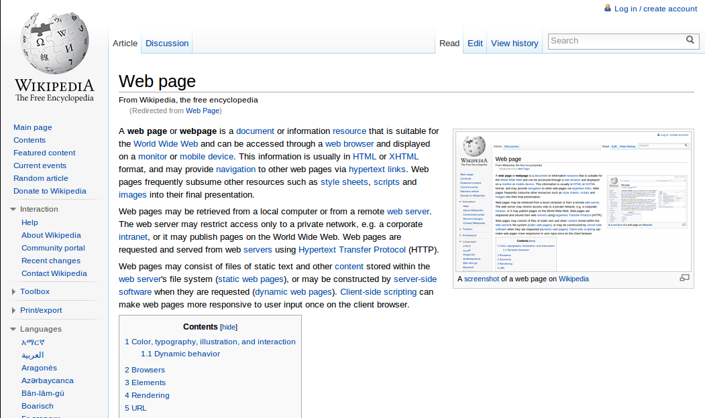
#+begin_export html

<small>
<a href="https://en.wikipedia.org/wiki/Recursion#/media/File:Web_Page.png"> Web-page recursion  </a>
</small>

#+end_export

** GNU: Git subcommand
#+BEGIN_NOTES
- SECOND OBSERVATION
- when we reach a terminating state (like ~git commit~), we don't
  need to go any further
- what kind of data structure is called for when we descend through a hierarchy of possibilities
  and reach a terminating case? 
- a TREE!
#+END_NOTES
#+begin_src bash :session *bash* :eval no
git commit --help | head -13
#+end_src

#+begin_export html
<pre class="example">
GIT-COMMIT(1)                                                   Git Manual

NAME
       git-commit - Record changes to the repository

SYNOPSIS
       git commit [-a | --interactive | --patch] [-s] [-v] [-u&lt;mode&gt;] [--amend]
                  [--dry-run] [(-c | -C | --fixup | --squash) &lt;commit&gt;]
                  [-F &lt;file&gt; | -m &lt;msg&gt;] [--reset-author] [--allow-empty]
                  [--allow-empty-message] [--no-verify] [-e] [--author=&lt;author&gt;]
                  [--date=&lt;date&gt;] [--cleanup=&lt;mode&gt;] [--[no-]status]
                  [-i | -o] [--pathspec-from-file=&lt;file&gt; [--pathspec-file-nul]]
                  [-S[&lt;keyid&gt;]] [--] [&lt;pathspec&gt;...]
</pre>
#+end_export 

** Observation: Treezer Goode
#+attr_html: :width 85% :align center

#+begin_export html

<small>
<a href="https://www.sciencenewsforstudents.org/article/lets-learn-about-trees"> Sarah Zielenski <em>ScienceNews for Students</em> (2020-04-22)</a>
</small>

#+end_export

** Þ Auld PyÞone 
** Python\dots
The way it used to be
** Python: ~argparse~
#+begin_notes
- part of the Python standard library
- predecessors included ~optparse~
- highly mature---around for years
- "glue"
- can we use it as a DSL?
#+end_notes

#+attr_reveal: :frag (shrink grow) 
- "Batteries included"
- DSL?

** Python: subcommands with ~argparse~ 
#+begin_notes
- here's something I pulled from the web
- uses ~argparse~
- fairly complex subcommand structure
- let's see how difficult it is to construct a parser using
  ~argparse~
#+end_notes

#+begin_export html 
<pre><code class="bash" data-line-numbers="">cmd query host host_name
cmd query profile profile_name
cmd query environment environment_name
cmd add host host_name
cmd add profile profile_name
cmd add environment environment_name
cmd update host host_name
</code></pre>
#+end_export

** Python: subcommands with ~argparse~ (muchos fun!)
#+BEGIN_NOTES
- OBSERVATION
- what if we want to change order?
- how do we /reason/ with this stuff?
- ~argparse~---while it has elements of our required DSL---is used in an imperative way
#+END_NOTES
#+begin_export html 
<pre><code class="python" data-line-numbers="1|4-5|15|21|27|35|41|47|55|7-9|11-12|13-14|15-17|19-23|25-29|67-68">import argparse
from mock import Mock

parser           = argparse.ArgumentParser()
subparsers       = parser.add_subparsers()

query_group      = subparsers.add_parser('query')
add_group        = subparsers.add_parser('add')
update_group     = subparsers.add_parser('update')

### query
subparsers       = query_group.add_subparsers()
#   query host
host_query       = subparsers.add_parser('host')
#   query host host_name
host_query.add_argument('host_name')
host_query.set_defaults(func=m.query_host)

#   query profile
profile_query     = subparsers.add_parser('profile')
#   query profile profile_name
profile_query.add_argument('profile_name')
profile_query.set_defaults(func=m.query_profile)

#   query environment
environment_query = subparsers.add_parser('environment')
#   query environment environment_name
environment_query.add_argument('environment_name')
environment_query.set_defaults(func=m.query_environment)

### add
subparsers        = add_group.add_subparsers()
#   add host
host_add          = subparsers.add_parser('host')
#   add host host_name
host_add.add_argument('host_name')
host_add.set_defaults(func=m.add_host)

#   add profile
profile_add       = subparsers.add_parser('profile')
#   add profile profile_name
profile_add.add_argument('profile_name')
profile_add.set_defaults(func=m.add_profile)

#   add environment
environment_add   = subparsers.add_parser('environment')
#   add environment environment_name
environment_add.add_argument('environment_name')
environment_add.set_defaults(func=m.add_environment)

### update
subparsers        = update_group.add_subparsers()
#   update host
host_update       = subparsers.add_parser('host')
#   update host host_name
host_update.add_argument('host_name')
host_update.set_defaults(func=m.update_host)

profile_update    = subparsers.add_parser('profile')
profile_update.add_argument('profile_name')
profile_update.set_defaults(func=m.update_profile)

environment_update = subparsers.add_parser('environment')
environment_update.add_argument('environment_name')
environment_update.set_defaults(func=m.update_environment)

options = parser.parse_args()
options.func(options)

print(m.method_calls)
</code></pre>
#+end_export

** Python: muchos fun :(
#+begin_export html 
<pre class="fragment fade-in"><code class="bash">python lusis.py -h
</code></pre>
#+end_export

#+begin_export html
<pre class="example fragment fade-in">usage: lusis.py [-h] {query,add,update} ...

positional arguments:
  {query,add,update}

optional arguments:
  -h, --help          show this help message and exit
</pre>
#+end_export 

#+begin_export html 
<pre class="fragment fade-in"><code class="bash">python lusis.py query -h
</code></pre>
#+end_export

#+begin_export html
<pre class="example fragment fade-in">usage: lusis.py query [-h] {host,profile,environment} ...
 
positional arguments:
   {host,profile,environment}

optional arguments:
   -h, --help            show this help message and exit
</pre>
#+end_export 

#+begin_export html

<small>
<a href="https://gist.github.com/lusis/624782"> John E. ("<code>lusis</code>") Vincent</a>
<code>lusis/python argparse subcommand subparsers.py</code>
</small>

#+end_export

** Python: subcommands with ~argparse~ 
#+begin_notes
- despite all that, it does construct a parser to do this complex set of things
- OBSERVATION: what do we call this type of thing where we insist on
  actions over intent?
#+end_notes

#+begin_export html 
<pre><code class="bash" data-line-numbers="">cmd query host host_name
cmd query profile profile_name
cmd query environment environment_name
cmd add host host_name
cmd add profile profile_name
cmd add environment environment_name
cmd update host host_name
</code></pre>
#+end_export

** Observation: Imperative
#+attr_html: :width 55% :align center
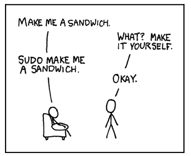
#+begin_export html

<small>
<a href="https://xkcd.com/149/"> Sandwich <em>xkcd</em></a>
</small>

#+end_export

** Python: The CLI Renaissance
#+attr_reveal: :frag (shrink shrink) 
- ~plac~
- ~click~

** Python: ~plac~
#+begin_export html 
<pre><code class="python" data-line-numbers="1|3-5|6">import plac

@plac.flg('list_')  # avoid clash with builtin
@plac.flg('yield_')  # avoid clash with keyword
@plac.opt('sys_')  # avoid clash with a very common name
def main(list_, yield_=False, sys_=100):
    print(list_)
    print(yield_)
    print(sys_)

if __name__ == '__main__':
    plac.call(main)
</code></pre>
#+end_export
#+begin_export html
<pre class="example fragment fade-in">bash$ python example13.py --help 
usage: example13.py [-h] [-l] [-y] [-s 100]

optional arguments:
  -h, --help         show this help message and exit
  -l, --list
  -y, --yield        [False]
  -s 100, --sys 100  [100]
</pre>
#+end_export 

#+begin_export html

<small>
<a href="https://github.com/ialbert/plac"> <code>plac</code> <em>Python package that can generate command line parameters from function signatures</em></a>
</small>

#+end_export

** Python: ~click~
#+begin_export html 
<pre><code class="python" data-line-numbers="1|3-6|7">import click

@click.command()
@click.option('--count', default=1, help='Number of greetings.')
@click.option('--name', prompt='Your name',
              help='The person to greet.')
def hello(count, name):
    """Simple program that greets NAME for a total of COUNT times."""
    for x in range(count):
        click.echo(f"Hello {name}!")

if __name__ == '__main__':
    hello()
</code></pre>
#+end_export

#+begin_export html
<pre class="example fragment fade-in">bash$ python hello.py --help
Usage: hello.py [OPTIONS]

  Simple program that greets NAME for a total of COUNT times.

Options:
  --count INTEGER  Number of greetings.
  --name TEXT      The person to greet.
  --help           Show this message and exit.
</pre>
#+end_export 

#+begin_export html

<small>

<em align="right"> Python package for creating beautiful command line interfaces in a composable way with as little code as necessary. It's the "Command Line Interface Creation Kit".</em>
</small>

#+end_export

** C/C++
#+attr_html: :width 55% :align center
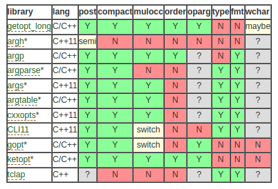
#+begin_export html

<small>
<a href="https://attractivechaos.wordpress.com/2018/08/31/a-survey-of-argument-parsing-libraries-in-c-c/"> A survey of argument parsing libraries in C/C++ <em><code>attractivechaos</code></em> (2018-08-31)</a>
</small>

#+end_export

** C: ~argparse~
#+begin_export html 
<pre><code class="C" data-line-numbers="4|57-60|62-64|65-69|70|71|77-86|18-20|47-49">#include <stdio.h>
#include <stdlib.h>
#include <string.h>
#include "argparse.h"

#define ARRAY_SIZE(x) (sizeof(x) / sizeof(x[0]))

static const char *const usages[] = {
    "subcommands [options] [cmd] [args]",
    NULL,
};

struct cmd_struct {
    const char *cmd;
    int (*fn) (int, const char **);
};

int
cmd_foo(int argc, const char **argv)
{
    printf("executing subcommand foo\n");
    printf("argc: %d\n", argc);
    for (int i = 0; i < argc; i++) {
        printf("argv[%d]: %s\n", i, *(argv + i));
    }
    int force = 0;
    int test = 0;
    const char *path = NULL;
    struct argparse_option options[] = {
        OPT_HELP(),
        OPT_BOOLEAN('f', "force", &force, "force to do", NULL, 0, 0),
        OPT_BOOLEAN('t', "test", &test, "test only", NULL, 0, 0),
        OPT_STRING('p', "path", &path, "path to read", NULL, 0, 0),
        OPT_END(),
    };
    struct argparse argparse;
    argparse_init(&argparse, options, usages, 0);
    argc = argparse_parse(&argparse, argc, argv);
    printf("after argparse_parse:\n");
    printf("argc: %d\n", argc);
    for (int i = 0; i < argc; i++) {
        printf("argv[%d]: %s\n", i, *(argv + i));
    }
    return 0;
}

int
cmd_bar(int argc, const char **argv)
{
    printf("executing subcommand bar\n");
    for (int i = 0; i < argc; i++) {
        printf("argv[%d]: %s\n", i, *(argv + i));
    }
    return 0;
}

static struct cmd_struct commands[] = {
    {"foo", cmd_foo},
    {"bar", cmd_bar},
};

int
main(int argc, const char **argv)
{
    struct argparse argparse;
    struct argparse_option options[] = {
        OPT_HELP(),
        OPT_END(),
    };
    argparse_init(&argparse, options, usages, ARGPARSE_STOP_AT_NON_OPTION);
    argc = argparse_parse(&argparse, argc, argv);
    if (argc < 1) {
        argparse_usage(&argparse);
        return -1;
    }

    /* Try to run command with args provided. */
    struct cmd_struct *cmd = NULL;
    for (int i = 0; i < ARRAY_SIZE(commands); i++) {
        if (!strcmp(commands[i].cmd, argv[0])) {
            cmd = &commands[i];
        }
    }
    if (cmd) {
        return cmd->fn(argc, argv);
    }
    return 0;
}
</code></pre>
#+end_export

#+begin_export html

<small>
<a href="https://github.com/cofyc/argparse"> 	
<code>argparse</code></a> <em> A command line arguments parsing library in C (compatible with C++)</em>
</small>

#+end_export

** C++: ~ArgumentParser~
#+begin_export html 
<pre><code class="C++" data-line-numbers="7|13-14|15-18|20-21|23-27|30|31|32|33|36|37|55-58">#include <iostream>

#include <seqan/basic.h>
#include <seqan/sequence.h>
#include <seqan/stream.h>      // For printing SeqAn Strings.

#include <seqan/arg_parse.h>

using namespace seqan;

int main(int argc, char const ** argv)
{
    // Initialize ArgumentParser.
    ArgumentParser parser("arg_parse_demo");
    setCategory(parser, "Demo");
    setShortDescription(parser, "Just a demo of the new ArgumentParser!");
    setVersion(parser, "0.1");
    setDate(parser, "Mar 2012");

    // Add use and description lines.
    addUsageLine(parser, "[\\fIOPTIONS\\fP] \\fIIN\\fP \\fIOUT\\fP ");

    addDescription(
        parser,
        "This is just a little demo to show what ArgumentParser is "
        "able to do.  \\fIIN\\fP is a multi-FASTA input file.  \\fIOUT\\fP is a "
        "txt output file.");

    // Add positional arguments and set their valid file types.
    addArgument(parser, ArgParseArgument(ArgParseArgument::INPUT_FILE, "IN"));
    addArgument(parser, ArgParseArgument(ArgParseArgument::OUTPUT_FILE, "OUT"));
    setValidValues(parser, 0, "FASTA fa");
    setValidValues(parser, 1, "txt");

    // Add a section with some options.
    addSection(parser, "Important Tool Parameters");
    addOption(parser, ArgParseOption("", "id", "Sequence identity between [0.0:1.0]",
                                     ArgParseArgument::DOUBLE, "ID"));
    setRequired(parser, "id", true);
    setMinValue(parser, "id", "0.0");
    setMaxValue(parser, "id", "1.0");

    // Adding a verbose and a hidden option.
    addSection(parser, "Miscellaneous");
    addOption(parser, ArgParseOption("v", "verbose", "Turn on verbose output."));
    addOption(parser, ArgParseOption("H", "hidden", "Super mysterious flag that will not be shown in "
                                                    "the help screen or man page."));
    hideOption(parser, "H");

    // Add a Reference section.
    addTextSection(parser, "References");
    addText(parser, "http://www.seqan.de");

    // Parse the arguments.
    ArgumentParser::ParseResult res = parse(parser, argc, argv);
    // Return if there was an error or a built-in command was triggered (e.g. help).
    if (res != ArgumentParser::PARSE_OK)
        return res == ArgumentParser::PARSE_ERROR;  // 1 on errors, 0 otherwise

    // Extract and print the options.
    bool verbose = false;
    getOptionValue(verbose, parser, "verbose");
    std::cout << "Verbose:     " << (verbose ? "on" : "off") << std::endl;

    double identity = -1.0;
    getOptionValue(identity, parser, "id");
    std::cout << "Identity:    " << identity << std::endl;

    CharString inputFile, outputFile;
    getArgumentValue(inputFile, parser, 0);
    getArgumentValue(outputFile, parser, 1);

    std::cout << "Input-File:  " << inputFile << std::endl;
    std::cout << "Output-File: " << outputFile << std::endl;

    return 0;
}
</code></pre>
#+end_export

#+begin_export html

<small>
<a href="http://docs.seqan.de/seqan/master/?p=ArgumentParser"> 	
<code>ArgumentParser</code></a> <em>Parse the command line</em>
</small>

#+end_export

** Java: ~picocli~
#+begin_export html
<pre><code class="java" data-line-numbers="|18|19|21,24,25|49">/**
 * ASCII Art: Basic Picocli based sample application
 * Explanation: <a href="https://picocli.info/quick-guide.html#_basic_example_asciiart">Picocli quick guide</a>
 * Source Code: <a href="https://github.com/remkop/picocli/blob/master/picocli-examples/src/main/java/picocli/examples/i18n/I18NDemo.java">GitHub</a> 
 * @author Andreas Deininger
 */
import picocli.CommandLine;
import picocli.CommandLine.Command;
import picocli.CommandLine.Option;
import picocli.CommandLine.Parameters;

import java.awt.Font;
import java.awt.Graphics;
import java.awt.Graphics2D;
import java.awt.RenderingHints;
import java.awt.image.BufferedImage;

@Command(name = "ASCIIArt", version = "ASCIIArt 1.0", mixinStandardHelpOptions = true) // |1|
public class ASCIIArt implements Runnable { // |2|

    @Option(names = { "-s", "--font-size" }, description = "Font size") // |3|
    int fontSize = 14;

    @Parameters(paramLabel = "<word>", defaultValue = "Hello, picocli",  // |4|
               description = "Words to be translated into ASCII art.")
    private String[] words = { "Hello,", "picocli" }; // |5|

    @Override
    public void run() { // |6|
        // https://stackoverflow.com/questions/7098972/ascii-art-java
        BufferedImage image = new BufferedImage(144, 32, BufferedImage.TYPE_INT_RGB);
        Graphics graphics = image.getGraphics();
        graphics.setFont(new Font("Dialog", Font.PLAIN, fontSize));
        Graphics2D graphics2D = (Graphics2D) graphics;
        graphics2D.setRenderingHint(RenderingHints.KEY_TEXT_ANTIALIASING,
                RenderingHints.VALUE_TEXT_ANTIALIAS_ON);
        graphics2D.drawString(String.join(" ", words), 6, 24);

        for (int y = 0; y < 32; y++) {
            StringBuilder builder = new StringBuilder();
            for (int x = 0; x < 144; x++)
                builder.append(image.getRGB(x, y) == -16777216 ? " " : image.getRGB(x, y) == -1 ? "#" : "*");
            if (builder.toString().trim().isEmpty()) continue;
            System.out.println(builder);
        }
    }

    public static void main(String[] args) {
        int exitCode = new CommandLine(new ASCIIArt()).execute(args); // |7|
        System.exit(exitCode); // |8|
    }
}
</code></pre>
#+end_export 

#+begin_export html

<small>
<a href="https://picocli.info/"> 	
<code>picocli</code></a>&mdash;<em>a mighty tiny command line interface</em>
</small>

#+end_export

** Python-le-Nouveau
*** Subcommands & options
:PROPERTIES:
:REVEAL_EXTRA_ATTR: data-auto-animate
:END:

#+ATTR_REVEAL: :data_id cli-cmd
#+begin_export html 
<pre><code class="bash" data-line-numbers="-|1|2|3|4">cmd hdfs stop
cmd hdfs start
cmd spark stop cluster --instance=instance-2 --verbose
cmd spark start cluster --instance=instance-1 --quietly
</code></pre>
#+end_export

*** Python: pure data
:PROPERTIES:
:REVEAL_EXTRA_ATTR: data-auto-animate
:END:

#+ATTR_REVEAL: :data_id spark-view-2
#+begin_export html 
<pre><code class="python" data-line-numbers="1-2">view = {
}
</code></pre>
#+end_export

*** Python: pure data
:PROPERTIES:
:REVEAL_EXTRA_ATTR: data-auto-animate
:END:

#+ATTR_REVEAL: :data_id spark-view-2
#+begin_export html 
<pre><code class="bash">cmd spark stop cluster --instance=instance-2 --verbose
</code></pre>
#+end_export
#+begin_export html 
<pre><code class="python" data-line-numbers="2,3">view = {
    'spark|stop|cluster': {
    },
}
</code></pre>
#+end_export

*** Python: pure data
:PROPERTIES:
:REVEAL_EXTRA_ATTR: data-auto-animate
:END:

#+ATTR_REVEAL: :data_id spark-view-2
#+begin_export html 
<pre><code class="bash">cmd spark stop cluster --instance=instance-2 --verbose
</code></pre>
#+end_export
#+begin_export html 
<pre><code class="python" data-line-numbers="3">view = {
    'spark|stop|cluster': {
        'callback':  spark_stop_cluster,
    },
}
</code></pre>
#+end_export

*** Python: pure data
:PROPERTIES:
:REVEAL_EXTRA_ATTR: data-auto-animate
:END:

#+BEGIN_NOTES
- OBSERVATION
- what do we call this pattern---clean separation of concerns?
#+END_NOTES
#+ATTR_REVEAL: :data_id spark-view-2
#+begin_export html 
<pre><code class="bash">cmd spark stop cluster --instance=instance-2 --verbose
</code></pre>
#+end_export
#+begin_export html 
<pre><code class="python" data-line-numbers="4-8">view = {
    'spark|stop|cluster': {
        'callback':  spark_stop_cluster,
        '--instance': {
            'help':     'Spark cluster instance',
            'default':  'instance-1',
            'choices':   ['instance-1', 'instance-2'],
        },
    },
}
</code></pre>
#+end_export

*** Observation: MVC
#+attr_html: :width 25% :align center
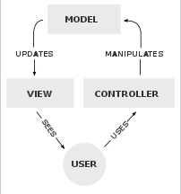
#+begin_export html

<small>
<a href="https://en.wikipedia.org/wiki/Model%E2%80%93view%E2%80%93controller"> Model-view-controller <em>Wikipedia</em></a>
</small>

#+end_export

*** Python: View (pure data)
:PROPERTIES:
:REVEAL_EXTRA_ATTR: data-auto-animate
:END:

#+ATTR_REVEAL: :data_id spark-view-2
#+begin_export html 
<pre><code class="bash" data-line-numbers="2">cmd spark start cluster --instance=instance-2 --verbose
cmd spark stop cluster --instance=instance-2 --verbose
</code></pre>
#+end_export
#+begin_export html 
<pre><code class="python" data-line-numbers="10-17">view = {
    'spark|start|cluster': {
        'callback':  spark_start_cluster,
        '--instance': {
            'help':     'Spark cluster instance',
            'default':  'instance-1',
            'choices':   ['instance-1', 'instance-2'],
        },
    },
    'spark|stop|cluster': {
        'callback':  spark_stop_cluster,
        '--instance': {
            'help':     'Spark cluster instance',
            'default':  'instance-1',
            'choices':   ['instance-1', 'instance-2'],
        },
    },
}
</code></pre>
#+end_export

*** Python: View (pure data)
#+begin_export html 
<pre><code class="python" data-line-numbers="1,18|2,10|3,11|4-8,12-16">view = {
    'spark|start|cluster': {
        'callback':  spark_start_cluster,
        '--instance': {
            'help':     'Spark cluster instance',
            'default':  'instance-1',
            'choices':   ['instance-1', 'instance-2'],
        },
    },
    'spark|stop|cluster': {
        'callback':  spark_stop_cluster,
        '--instance': {
            'help':     'Spark cluster instance',
            'default':  'instance-1',
            'choices':   ['instance-1', 'instance-2'],
        },
    },
}
</code></pre>
#+end_export

*** Python: View (pure data)
#+begin_export html 
<pre><code class="python" data-line-numbers="1,26|2,10,18,22|3,11,19,23">view = {
    'spark|start|cluster': {
        'callback':  spark_start_cluster,
        '--instance': {
            'help':     'Spark cluster instance',
            'default':  'instance-1',
            'choices':   ['instance-1', 'instance-2'],
        },
    },
    'spark|stop|cluster': {
        'callback':  spark_stop_cluster,
        '--instance': {
            'help':     'Spark cluster instance',
            'default':  'instance-1',
            'choices':   ['instance-1', 'instance-2'],
        },
    },
    'hdfs|start': {
        'callback':  hdfs_start,
        'help':     'Start Hadoop',
    },
    'hdfs|stop': {
        'callback':  hdfs_stop,
        'help':     'Stop Hadoop',
    },
}
</code></pre>
#+end_export

*** Python: complete program
#+begin_export html 
<pre><code class="python" data-line-numbers="|2|4,5,8,9|12,37|13,21,29,33|14,22,30,34|15,23,31,35|40|41|42">import sys
from parsearg import ParseArg
from spark import (
    spark_start_cluster,
    spark_stop_cluster,
)
from hdfs import (
    hdfs_start,
    hdfs_stop,
)

view = {
    'spark|start': {
        'callback':  spark_start_cluster,
        '--instance': {
            'help':     'Spark cluster instance',
            'default':  'instance-1',
            'choices':   ['instance-1', 'instance-2'],
        },
    },
    'spark|stop': {
        'callback':  spark_stop_cluster,
        '--instance': {
            'help':     'Spark cluster instance',
            'default':  'instance-1',
            'choices':   ['instance-1', 'instance-2'],
        },
    },
    'hdfs|start': {
        'callback':  hdfs_start,
        'help':     'Start Hadoop',
    },
    'hdfs|stop': {
        'callback':  hdfs_stop,
        'help':     'Stop Hadoop',
    },
}

def main(args: list)-> None:
    parser = ParseArg(view)
    ns     = parser.parse_args(args)
    result = ns.callback(ns)

if __name__ == "__main__":
    args = sys.argv[1:] if len(sys.argv) > 1 else []
    main(' '.join(args))
</code></pre>
#+end_export

*** Subcommands & options
#+begin_export html 
<pre><code class="bash" data-line-numbers="3">cmd hdfs stop
cmd hdfs start
cmd spark stop cluster --instance=instance-2 --verbose
cmd spark start cluster --instance=instance-1 --quietly
</code></pre>
#+end_export

*** Subcommands: reordered 
#+begin_export html 
<pre><code class="bash" data-line-numbers="3">cmd cluster stop hdfs
cmd cluster start hdfs 
cmd cluster stop spark --instance=instance-2 --verbose
cmd cluster start spark --instance=instance-1 --quietly
</code></pre>
#+end_export

*** Subcommands: reordered 
#+begin_export html 
<pre><code class="bash">cmd spark stop cluster --instance=instance-2 --verbose
cmd cluster stop spark --instance=instance-2 --verbose
</code></pre>
#+end_export

*** Python: View---original order 
#+begin_export html 
<pre><code class="bash" data-line-numbers="3">cmd hdfs stop
cmd hdfs start
cmd spark stop cluster --instance=instance-2 --verbose
cmd spark start cluster --instance=instance-1 --quietly
</code></pre>
#+end_export
#+begin_export html 
<pre><code class="python" data-line-numbers="10">view = {
    'spark|start|cluster': {
        'callback':  spark_start_cluster,
        '--instance': {
            'help':     'Spark cluster instance',
            'default':  'instance-1',
            'choices':   ['instance-1', 'instance-2'],
        },
    },
    'spark|stop|cluster': {
        'callback':  spark_stop_cluster,
        '--instance': {
            'help':     'Spark cluster instance',
            'default':  'instance-1',
            'choices':   ['instance-1', 'instance-2'],
        },
    },
    'hdfs|start': {
        'callback':  hdfs_start,
        'help':     'Start Hadoop',
    },
    'hdfs|stop': {
        'callback':  hdfs_stop,
        'help':     'Stop Hadoop',
    },
}
</code></pre>
#+end_export

*** Python: View---reordered subcommands
#+begin_export html 
<pre><code class="bash" data-line-numbers="3">cmd cluster stop hdfs
cmd cluster start hdfs 
cmd cluster stop spark --instance=instance-2 --verbose
cmd cluster start spark --instance=instance-1 --quietly
</code></pre>
#+end_export
#+begin_export html 
<pre><code class="python" data-line-numbers="10">view = {
    'cluster|start|spark': {
        'callback':  spark_start_cluster,
        '--instance': {
            'help':     'Spark cluster instance',
            'default':  'instance-1',
            'choices':   ['instance-1', 'instance-2'],
        },
    },
    'cluster|stop|spark': {
        'callback':  spark_stop_cluster,
        '--instance': {
            'help':     'Spark cluster instance',
            'default':  'instance-1',
            'choices':   ['instance-1', 'instance-2'],
        },
    },
    'cluster|start|hdfs': {
        'callback':  hdfs_start,
        'help':     'Start Hadoop',
    },
    'cluster|stop|hdfs': {
        'callback':  hdfs_stop,
        'help':     'Stop Hadoop',
    },
}
</code></pre>
#+end_export

** R
*** Subcommands & options
:PROPERTIES:
:REVEAL_EXTRA_ATTR: data-auto-animate
:END:

#+ATTR_REVEAL: :data_id cli-cmd-r
#+begin_export html 
<pre><code class="bash" data-line-numbers="-|1|2|3|4">cmd hdfs stop
cmd hdfs start
cmd spark stop cluster --instance=instance-2 --verbose
cmd spark start cluster --instance=instance-1 --quietly
</code></pre>
#+end_export

*** R: View (pure data)
:PROPERTIES:
:REVEAL_EXTRA_ATTR: data-auto-animate
:END:

#+ATTR_REVEAL: :data_id spark-view-r
#+begin_export html 
<pre><code class="R" data-line-numbers="1,2">view = list(
)
</code></pre>
#+end_export

*** R: View (pure data)
:PROPERTIES:
:REVEAL_EXTRA_ATTR: data-auto-animate
:END:

#+ATTR_REVEAL: :data_id spark-view-r
#+begin_export html 
<pre><code class="R" data-line-numbers="2">view = list(
    `spark|start|cluster` = list()
)
</code></pre>
#+end_export

*** R: View (pure data)
:PROPERTIES:
:REVEAL_EXTRA_ATTR: data-auto-animate
:END:

#+ATTR_REVEAL: :data_id spark-view-r
#+begin_export html 
<pre><code class="R" data-line-numbers="3">view = list(
    `spark|start|cluster` = list(
        `callback` = spark_start_cluster
    )
)
</code></pre>
#+end_export

*** R: View (pure data)
:PROPERTIES:
:REVEAL_EXTRA_ATTR: data-auto-animate
:END:

#+ATTR_REVEAL: :data_id spark-view-r
#+begin_export html 
<pre><code class="R" data-line-numbers="4-8">view = list(
    `spark|start|cluster` = list(
        `callback`    = spark_start_cluster,
        `--instance`  = list(
            `help`    =  'Spark cluster instance',
            `default` =  'instance-1',
            `choices` =   c('instance-1', 'instance-2')
        )
    )
)
</code></pre>
#+end_export

*** R: View (pure data)
:PROPERTIES:
:REVEAL_EXTRA_ATTR: data-auto-animate
:END:

#+ATTR_REVEAL: :data_id spark-view-r
#+begin_export html 
<pre><code class="R" data-line-numbers="10-17">view = list(
    `spark|start|cluster` = list(
        `callback`    = spark_start_cluster,
        `--instance`  = list(
            `help`    =  'Spark cluster instance',
            `default` =  'instance-1',
            `choices` =   c('instance-1', 'instance-2')
        )
    ),
    `spark|stop|cluster` = list(
        `callback`    = spark_stop_cluster,
        `--instance`  = list(
            `help`    =  'Spark cluster instance',
            `default` =  'instance-1',
            `choices` =   c('instance-1', 'instance-2')
        )
    )
)
</code></pre>
#+end_export

*** R: View (pure data)
:PROPERTIES:
:REVEAL_EXTRA_ATTR: data-auto-animate
:END:

#+ATTR_REVEAL: :data_id spark-view-r
#+begin_export html 
<pre><code class="R" data-line-numbers="1,30|2,10,18,24|3,11,19,25|4-8,12-16,20-22,26-28">view = list(
    `spark|start|cluster` = list(
        `callback`    = spark_start_cluster,
        `--instance`  = list(
            `help`    =  'Spark cluster instance',
            `default` =  'instance-1',
            `choices` =   c('instance-1', 'instance-2')
        )
    ),
    `spark|stop|cluster` = list(
        `callback`    = spark_stop_cluster,
        `--instance`  = list(
            `help`    =  'Spark cluster instance',
            `default` =  'instance-1',
            `choices` =   c('instance-1', 'instance-2')
        )
    ),
    `hdfs|start` = list(
        `callback`    = hdfs_start,
        `--instance`  = list(
            `help`    =  'Start Hadoop'
        )
    ),
    `hdfs|stop` = list(
        `callback`    = hdfs_stop,
        `--instance`  = list(
            `help`    =  'Stop Hadoop'
        )
    )
)
</code></pre>
#+end_export

*** R: complete program
#+begin_export html 
<pre><code class="R" data-line-numbers="|1|3|5,7,9,11|6,8,10,12|16,24,32,38|45|46|47|48|50"> #!/usr/bin/Rscript --no-init-file

suppressPackageStartupMessages(library(parsearg))

`spark_start_cluster`<- function(args) 
    cat(sprintf("starting Spark cluster instance=%s", args.instance)),
`spark_stop_cluster`<- function(args) 
    cat(sprintf("stopping Spark cluster instance=%s", args.instance)),
`hdfs_start`<- function(args) 
    cat(sprintf("starting HDFS cluster instance=%s", args.instance)),
`hdfs_stop`<- function(args) 
    cat(sprintf("stopping HDFS cluster instance=%s", args.instance)),

view = list(
    `spark|start|cluster` = list(
        `callback`    = spark_start_cluster,
        `--instance`  = list(
            `help`    =  'Spark cluster instance',
            `default` =  'instance-1',
            `choices` =   c('instance-1', 'instance-2')
        )
    ),
    `spark|stop|cluster` = list(
        `callback`    = spark_stop_cluster,
        `--instance`  = list(
            `help`    =  'Spark cluster instance',
            `default` =  'instance-1',
            `choices` =   c('instance-1', 'instance-2')
        )
    ),
    `hdfs|start` = list(
        `callback`    = hdfs_start,
        `--instance`  = list(
            `help`    =  'Start Hadoop'
        )
    ),
    `hdfs|stop` = list(
        `callback`    = hdfs_stop,
        `--instance`  = list(
            `help`    =  'Stop Hadoop'
        )
    )
)

`main`<- function(args=commandArgs(trailingOnly=TRUE)) {
    parser<- ParseArg(view)
    ns<-     parser$parse_args(args)
    result<- ns$callback(ns)
}
main()
</code></pre>
#+end_export

*** R: complete program (alt)
#+begin_export html 
<pre><code class="R" data-line-numbers="45-48"> #!/usr/bin/Rscript --no-init-file

suppressPackageStartupMessages(library(parsearg))

`spark_start_cluster`<- function(args) 
    cat(sprintf("starting Spark cluster instance=%s", args.instance)),
`spark_stop_cluster`<- function(args) 
    cat(sprintf("stopping Spark cluster instance=%s", args.instance)),
`hdfs_start`<- function(args) 
    cat(sprintf("starting HDFS cluster instance=%s", args.instance)),
`hdfs_stop`<- function(args) 
    cat(sprintf("stopping HDFS cluster instance=%s", args.instance)),

view = list(
    `spark|start|cluster` = list(
        `callback`    = spark_start_cluster,
        `--instance`  = list(
            `help`    =  'Spark cluster instance',
            `default` =  'instance-1',
            `choices` =   c('instance-1', 'instance-2')
        )
    ),
    `spark|stop|cluster` = list(
        `callback`    = spark_stop_cluster,
        `--instance`  = list(
            `help`    =  'Spark cluster instance',
            `default` =  'instance-1',
            `choices` =   c('instance-1', 'instance-2')
        )
    ),
    `hdfs|start` = list(
        `callback`    = hdfs_start,
        `--instance`  = list(
            `help`    =  'Start Hadoop'
        )
    ),
    `hdfs|stop` = list(
        `callback`    = hdfs_stop,
        `--instance`  = list(
            `help`    =  'Stop Hadoop'
        )
    )
)

args<-   commandArgs(trailingOnly=TRUE)
parser<- ParseArg(view)
ns<-     parser$parse_args(args)
result<- ns$callback(ns)
</code></pre>
#+end_export

** Observations
#+attr_reveal: :frag (fade-in fade-in fade-in fade-in fade-in)
- DSL: 
    + positional arguments 
    + options
    + subcommands 
- Recursion: subcommands
- Tree: hierarchy + terminating case
- Declarative not Imperative: pure data
- MVC: separation of concerns

* University of CLI 
** UCLI @ DSL
*** ~argparse~: Python
:PROPERTIES:
:REVEAL_EXTRA_ATTR: data-auto-animate
:END:

#+attr_reveal: :data_id argparse
#+attr_html: :width 75% :align center
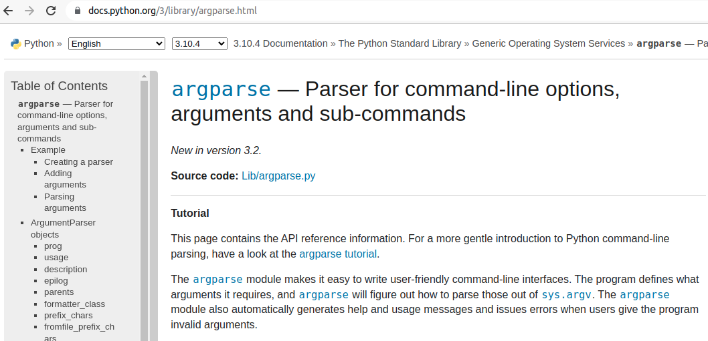
#+begin_export html

<small>
<a href="https://docs.python.org/3/library/argparse.html"> Part of Python's standard library</a>
</small>

#+end_export

*** ~argparse~: R
:PROPERTIES:
:REVEAL_EXTRA_ATTR: data-auto-animate
:END:

#+attr_reveal: :data_id argparse
#+attr_html: :width 15% :align center
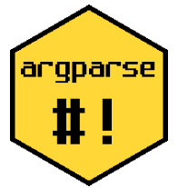
#+begin_export html

<small>
<a href="https://github.com/trevorld/r-argparse"> R version calls Python</a>
</small>

#+end_export

*** ~parsearg~: Python, R
*** Canonical example
#+BEGIN_NOTES
- run from the shell
- or interactively
#+END_NOTES
#+begin_export html 
<pre>
<code class="R" data-line-numbers="-|1|3|44|5|6|8-11|13-17|19-20|22-41|8-11|13-17|20|22|32-35|8-17">#!/usr/bin/Rscript --no-init-file

library(argparse)

`square`<- function(args) {
    parser<- ArgumentParser()

    parser$add_argument("number", 
        type="integer",
        help="display the square of a given number"
    )

    parser$add_argument("-v", "--verbosity", 
        action="count",
        default=0,
        help="increase output verbosity"
    )

    args<-   parser$parse_args(args)
    answer<- args$number^2

    if (args$verbosity > 2) {
        o<- capture.output(example("^"))

        cat(sprintf("[verbosity level == %d]:\n", args$verbosity))
        cat(sprintf(
            "the square of %d equals %d, using the in-built arithmetic operator '^':\n",
            args$number, answer
        ))
        cat(sprintf("%s\n", o))
    }
    else if (args$verbosity == 2) {
        cat(sprintf("[verbosity level == %d]:\n", args$verbosity))
        cat(sprintf("the square of %d equals %d\n", args$number, answer))
    }
    else if (args$verbosity == 1) {
        cat(sprintf("the square of %d is %d\n", args$number, answer))
    }
    else {
        cat(sprintf("answer = %d\n", answer))
    }
}

square(args=commandArgs(trailingOnly=TRUE))
</code>

<code class="R fragment roll-up">bash$ R --no-init-file

R version 4.2.0 (2022-04-22) -- "Vigorous Calisthenics"
Copyright (C) 2022 The R Foundation for Statistical Computing
Platform: x86_64-pc-linux-gnu (64-bit)

R is free software and comes with ABSOLUTELY NO WARRANTY.
You are welcome to redistribute it under certain conditions.
Type 'license()' or 'licence()' for distribution details.

  Natural language support but running in an English locale

R is a collaborative project with many contributors.
Type 'contributors()' for more information and
'citation()' on how to cite R or R packages in publications.

Type 'demo()' for some demos, 'help()' for on-line help, or
'help.start()' for an HTML browser interface to help.
Type 'q()' to quit R.

> source('square')
> square('4') 
> square('4 -v') 
> square('4 -vv') 
> square('4 -vvvv') 
</code>

<code class="bash fragment roll-up">bash$ square 4
bash$ square 4 -v
bash$ square 4 -vv
bash$ square 4 -vvvv
</code>

<code class="bash fragment roll-up">bash$ ./square 2
answer = 4

bash$ ./square 2 -v
the square of 2 is 4

bash$ ./square 2 -vv
[verbosity level == 2]: 
the square of 2 equals 4

bash$ ./square 2 -vvv
[verbosity level == 3]:
the square of 2 equals 4, using the in-built arithmetic operator '^':

 ^> x <- -1:12
 
 ^> x + 1
  [1]  0  1  2  3  4  5  6  7  8  9 10 11 12 13
 
 ^> 2 * x + 3
  [1]  1  3  5  7  9 11 13 15 17 19 21 23 25 27
 
 ^> x %% 2 #-- is periodic
  [1] 1 0 1 0 1 0 1 0 1 0 1 0 1 0
 
 ^> x %/% 5
  [1] -1  0  0  0  0  0  1  1  1  1  1  2  2  2
 
 ^> x %% Inf # now is defined by limit (gave NaN in earlier versions of R)
  [1] Inf   0   1   2   3   4   5   6   7   8   9  10  11  12
</code>
</pre>
#+end_export 

*** Command-line arguments
#+BEGIN_NOTES
- We need to be careful about the terms that we use. 
- Let's introduce some terminology to avert confusion.
#+END_NOTES

#+begin_export html

<small>
<blockquote class="fragment fade-in" align="left"> DEFINITION. A command line comprises command-line arguments: </blockquote>
    <ol>
        <li class="fragment fade-in">the program name (first); and,</li>
        <li class="fragment fade-in">[other command-line arguments].</li>
    </ol>
</small>

#+end_export

*** The essence of an argument parser 
:PROPERTIES:
:REVEAL_EXTRA_ATTR: data-auto-animate
:END:

#+BEGIN_NOTES
- The task of an argument parser (such as ~argparse~) is
  to match the command-line arguments to variable names 
  in the ~argparse~ object. 

- We need to establish whether a command-line argument is positional or not, /i.e./
   does the /position/ of the command-line argument (relative to the program name)
   determine which variable name it is associated with?
#+END_NOTES

#+attr_reveal: :data_id essence
#+begin_export html

<small>
    <ol>
        <li class="fragment fade-in">firstly, associates a command-line argument with a <em>parser argument</em></li>
        <li class="fragment fade-in">secondly, associates the parser argument with a <em>variable name</em></li>
    </ol>
</small>

#+end_export

*** The essence of an argument parser 
:PROPERTIES:
:REVEAL_EXTRA_ATTR: data-auto-animate
:END:

#+BEGIN_NOTES
- The task of an argument parser (such as ~argparse~) is
  to match the command-line arguments to variable names 
  in the ~argparse~ object. 

- We need to establish whether a command-line argument is positional or not, /i.e./
   does the /position/ of the command-line argument (relative to the program name)
   determine which variable name it is associated with?
#+END_NOTES

#+attr_reveal: :data_id essence
#+begin_export html

<small>
    
command-line argument <code>-></code> parser argument <code>-></code> variable name 

</small>

#+end_export

*** The essence of an argument parser 
:PROPERTIES:
:REVEAL_EXTRA_ATTR: data-auto-animate
:END:

#+BEGIN_NOTES
- The task of an argument parser (such as ~argparse~) is
  to match the command-line arguments to variable names 
  in the ~argparse~ object. 

- We need to establish whether a command-line argument is positional or not, /i.e./
   does the /position/ of the command-line argument (relative to the program name)
   determine which variable name it is associated with?
#+END_NOTES

#+attr_reveal: :data_id essence
#+begin_export html

<small>
    
command-line "event" <code>-></code> variable name 

</small>

#+end_export

*** The essence of an argument parser 
:PROPERTIES:
:REVEAL_EXTRA_ATTR: data-auto-animate
:END:

#+BEGIN_NOTES
- The task of an argument parser (such as ~argparse~) is
  to match the command-line arguments to variable names 
  in the ~argparse~ object. 

- We need to establish whether a command-line argument is positional or not, /i.e./
   does the /position/ of the command-line argument (relative to the program name)
   determine which variable name it is associated with?
#+END_NOTES

#+attr_reveal: :data_id essence
#+begin_export html

<small>
    
command-line "event" <code>-></code> handle the event 

</small>

#+end_export

*** The essence of an argument parser 
:PROPERTIES:
:REVEAL_EXTRA_ATTR: data-auto-animate
:END:

#+BEGIN_NOTES
- The task of an argument parser (such as ~argparse~) is
  to match the command-line arguments to variable names 
  in the ~argparse~ object. 

- We need to establish whether a command-line argument is positional or not, /i.e./
   does the /position/ of the command-line argument (relative to the program name)
   determine which variable name it is associated with?
#+END_NOTES

#+attr_reveal: :data_id essence
#+begin_export html

<small>
    
event handling 

</small>

#+end_export

*** Command-line arguments: Unnamed 
:PROPERTIES:
:REVEAL_EXTRA_ATTR: data-auto-animate
:END:

#+BEGIN_NOTES
- If a command-line argument is /not named/ then it can 
  /only be recognized by its position/ within the 
  command-line argument list: There is no name to indicate
  where the argument occurs, so it is its /position/ that must
  establish its association with the variable.
#+END_NOTES

#+attr_reveal: :data_id cli-unnamed
#+begin_export html 
<pre>
<code class="bash fragment roll-up">bash$ square 3.141593
             ^^^^^^^^  # UNNAMED command-line argument:
                       # it is not named on the command line;
                       # the "event" is determined by its position
</code>
</pre>
#+end_export 

*** Command-line arguments: Unnamed 
:PROPERTIES:
:REVEAL_EXTRA_ATTR: data-auto-animate
:END:

#+BEGIN_NOTES
- If a command-line argument is /not named/ then it can 
  /only be recognized by its position/ within the 
  command-line argument list: There is no name to indicate
  where the argument occurs, so it is its /position/ that must
  establish its association with the variable.
#+END_NOTES

#+attr_reveal: :data_id cli-unnamed
#+begin_export html 
<pre>
<code class="R" data-line-numbers="8-11">#!/usr/bin/Rscript --no-init-file

library(argparse)

`square`<- function(args) {
    parser<- ArgumentParser()

    parser$add_argument("number", 
        type="integer",
        help="display the square of a given number"
    )

    parser$add_argument("-v", "--verbosity", 
        action="count",
        default=0,
        help="increase output verbosity"
    )

    args<-   parser$parse_args(args)
    answer<- args$number^2

    if (args$verbosity > 2) {
        o<- capture.output(example("^"))

        cat(sprintf("[verbosity level == %d]:\n", args$verbosity))
        cat(sprintf(
            "the square of %d equals %d, using the in-built arithmetic operator '^':\n",
            args$number, answer
        ))
        cat(sprintf("%s\n", o))
    }
    else if (args$verbosity == 2) {
        cat(sprintf("[verbosity level == %d]:\n", args$verbosity))
        cat(sprintf("the square of %d equals %d\n", args$number, answer))
    }
    else if (args$verbosity == 1) {
        cat(sprintf("the square of %d is %d\n", args$number, answer))
    }
    else {
        cat(sprintf("answer = %d\n", answer))
    }
}

square(args=commandArgs(trailingOnly=TRUE))
</code>
</pre>
#+end_export 

*** Command-line arguments: Named 
:PROPERTIES:
:REVEAL_EXTRA_ATTR: data-auto-animate
:END:

#+BEGIN_NOTES
- tag a command-line argument with a /short arg/ or a /flag/, 
- this /names/ the command-line argument and makes it /independent of position/, 
   /e.g./

- to name a command-line argument, use either:

        + ~-~  :: (a ``short arg''); or 
        + ~--~ :: (a ``flag'').

- a named command-line argument is /independent of its position/ on the 
  command line precisely because it has been /named/ by the short arg or flag.
#+END_NOTES

#+attr_reveal: :data_id cli-named
#+begin_export html 
<pre>
<code class="bash fragment roll-up">bash$ square -n 3.141593
             ^^           # SHORT ARG

bash$ square -n=3.141593
             ^^           # SHORT ARG

bash$ square -number 3.141593
             ^^^^^^^      # FLAG

bash$ square --number=3.141593
             ^^^^^^^^     # FLAG
</code>
</pre>
#+end_export 

*** Command-line arguments: Named 
:PROPERTIES:
:REVEAL_EXTRA_ATTR: data-auto-animate
:END:

#+BEGIN_NOTES
- tag a command-line argument with a /short arg/ or a /flag/, 
- this /names/ the command-line argument and makes it /independent of position/, 
   /e.g./

- to name a command-line argument, use either:

        + ~-~  :: (a ``short arg''); or 
        + ~--~ :: (a ``flag'').

- a named command-line argument is /independent of its position/ on the 
  command line precisely because it has been /named/ by the short arg or flag.
#+END_NOTES

#+attr_reveal: :data_id cli-named
#+begin_export html 
<pre>
<code class="R" data-line-numbers="8-11|20|28|34|37">#!/usr/bin/Rscript --no-init-file

library(argparse)

`square`<- function(args) {
    parser<- ArgumentParser()

    parser$add_argument("-n", "--number", 
        type="integer",
        help="display the square of a given number"
    )

    parser$add_argument("-v", "--verbosity", 
        action="count",
        default=0,
        help="increase output verbosity"
    )

    args<-   parser$parse_args(args)
    answer<- args$number^2

    if (args$verbosity > 2) {
        o<- capture.output(example("^"))

        cat(sprintf("[verbosity level == %d]:\n", args$verbosity))
        cat(sprintf(
            "the square of %d equals %d, using the in-built arithmetic operator '^':\n",
            args$number, answer
        ))
        cat(sprintf("%s\n", o))
    }
    else if (args$verbosity == 2) {
        cat(sprintf("[verbosity level == %d]:\n", args$verbosity))
        cat(sprintf("the square of %d equals %d\n", args$number, answer))
    }
    else if (args$verbosity == 1) {
        cat(sprintf("the square of %d is %d\n", args$number, answer))
    }
    else {
        cat(sprintf("answer = %d\n", answer))
    }
}

square(args=commandArgs(trailingOnly=TRUE))
</code>
</pre>
#+end_export 

*** Command-line arguments: Named 
:PROPERTIES:
:REVEAL_EXTRA_ATTR: data-auto-animate
:END:

#+BEGIN_NOTES
- tag a command-line argument with a /short arg/ or a /flag/, 
- this /names/ the command-line argument and makes it /independent of position/, 
   /e.g./

- to name a command-line argument, use either:

        + ~-~  :: (a ``short arg''); or 
        + ~--~ :: (a ``flag'').

- a named command-line argument is /independent of its position/ on the 
  command line precisely because it has been /named/ by the short arg or flag.
#+END_NOTES

#+attr_reveal: :data_id cli-named
#+begin_export html 
<pre>
<code class="R" data-line-numbers="11|21|29|35|38">#!/usr/bin/Rscript --no-init-file

library(argparse)

`square`<- function(args) {
    parser<- ArgumentParser()

    parser$add_argument("-n", "--number", 
        type="integer",
        help="display the square of a given number",
        dest="number_to_square"
    )

    parser$add_argument("-v", "--verbosity", 
        action="count",
        default=0,
        help="increase output verbosity"
    )

    args<-   parser$parse_args(args)
    answer<- args$number_to_square^2

    if (args$verbosity > 2) {
        o<- capture.output(example("^"))

        cat(sprintf("[verbosity level == %d]:\n", args$verbosity))
        cat(sprintf(
            "the square of %d equals %d, using the in-built arithmetic operator '^':\n",
            args$number_to_square, answer
        ))
        cat(sprintf("%s\n", o))
    }
    else if (args$verbosity == 2) {
        cat(sprintf("[verbosity level == %d]:\n", args$verbosity))
        cat(sprintf("the square of %d equals %d\n", args$number_to_square, answer))
    }
    else if (args$verbosity == 1) {
        cat(sprintf("the square of %d is %d\n", args$number_to_square, answer))
    }
    else {
        cat(sprintf("answer = %d\n", answer))
    }
}

square(args=commandArgs(trailingOnly=TRUE))
</code>
</pre>
#+end_export 

*** Positional and non-positional arguments
:PROPERTIES:
:REVEAL_EXTRA_ATTR: data-auto-animate
:END:

#+BEGIN_NOTES
- note
#+END_NOTES

#+attr_reveal: :data_id add_argument-docs
#+begin_export html 
<pre>
<code class="python" data-line-numbers="-|2|19-20">ArgumentParser.add_argument(
    name or flags...
    [, action]
    [, nargs]
    [, const]
    [, default]
    [, type]
    [, choices]
    [, required]
    [, help]
    [, metavar]
    [, dest]
)

Define how a single command-line argument should be parsed. Each parameter
has its own more detailed description below, but in short they are:

name or flags - Either a name or a list of option strings, 
                e.g. foo or -f, --foo.
action        - The basic type of action to be taken when this argument is 
                encountered at the command line.
nargs         - The number of command-line arguments that should be consumed.
const         - A constant value required by some action and nargs selections.
default       - The value produced if the argument is absent from the command line.
type          - The type to which the command-line argument should be converted.
choices       - A container of the allowable values for the argument.
required      - Whether or not the command-line option may be omitted 
                (optionals only).
help          - A brief description of what the argument does.
metavar       - A name for the argument in usage messages.
dest          - The name of the attribute to be added to the object returned 
                by parse_args().
</code>
</pre>
#+end_export 
#+begin_export html

<small>
<a href="https://docs.python.org/3/library/argparse.html#argparse.ArgumentParser.add_argument"> Python docs: <code>ArgumentParser.add_argument</code></a>
</small>

#+end_export

*** Positional and non-positional arguments
:PROPERTIES:
:REVEAL_EXTRA_ATTR: data-auto-animate
:END:

#+BEGIN_NOTES
- The method ~add_argument~ must know whether a positional argument or an
  optional argument is being added. 

- What distinguishes a "positional argument" from an "optional argument"?

- The term ``optional argument'' is therefore unfortunate if the 
    the argument is a /required/ argument: In this case, ``optional'' really
    means that the argument is a /required non-positional argument/.

- The terminology is therefore as unfortunate as it is confusing. 
    Optional arguments would perhaps better be referred to as /non-positional/
    arguments.  

- A positional argument is a name like ~foo~. An optional argument
    is a name prefixed by a short arg (something starting with ~-~ ) 
    or a flag (something starting with ~--~ ).  
    We can summarize thus:

    + positional argument :: 
        - occupies a /specific position/ on the command line
        - required argument /ipso facto/
        - has a parser-argument name like ~foo~

    + non-positional argument (a.k.a ``optional'') :: 
        - does /not/ occupy a specific position on the command line 
        - not required by default
        - all optional arguments are prefixed by either ~-~ or ~--~
        - a short arg like ~-f~ or a flag like ~--foo~ 
#+END_NOTES

#+attr_reveal: :data_id add_argument-docs
#+attr_reveal: :frag (appear)
#+attr_reveal: :data_id mvc
#+begin_export html

<small>
<ul>
    <li class="fragment fade-in"><strong>positional argument (unnamed)</strong>: </li>
        <ul>
            <li class="fragment fade-in"><em>required</em>: by default a positional argument ("name") must occupy a particular <em>position</em> on the command line</li>
        </ul>
    <li class="fragment fade-in"><strong>non-positional argument (named)</strong>: </li>
        <ul>
            <li class="fragment fade-in"><em>not required</em>: by default a non-positional ("optional") argument can be in <em>position</em> on the command line</li>
        </ul>
</ul>
</small>

#+end_export

*** Positional and non-positional arguments
:PROPERTIES:
:REVEAL_EXTRA_ATTR: data-auto-animate
:END:

#+BEGIN_NOTES
- The method ~add_argument~ must know whether a positional argument or an
  optional argument is being added. 

- What distinguishes a "positional argument" from an "optional argument"?

- The term ``optional argument'' is therefore unfortunate if the 
    the argument is a /required/ argument: In this case, ``optional'' really
    means that the argument is a /required non-positional argument/.

- The terminology is therefore as unfortunate as it is confusing. 
    Optional arguments would perhaps better be referred to as /non-positional/
    arguments.  

- A positional argument is a name like ~foo~. An optional argument
    is a name prefixed by a short arg (something starting with ~-~ ) 
    or a flag (something starting with ~--~ ).  
    We can summarize thus:

    + positional argument :: 
        - occupies a /specific position/ on the command line
        - required argument /ipso facto/
        - has a parser-argument name like ~foo~

    + non-positional argument (a.k.a ``optional'') :: 
        - does /not/ occupy a specific position on the command line 
        - not required by default
        - all optional arguments are prefixed by either ~-~ or ~--~
        - a short arg like ~-f~ or a flag like ~--foo~ 
#+END_NOTES

#+attr_reveal: :data_id add_argument-docs
#+attr_html: :width 15% :align center
#+headers:  :width 800 :height 500 
#+begin_src dot :exports results :results output graphics :file ./img/argparse-names-flags.png :eval no
digraph G {
    edge[arrowhead=none];
    "arg"                               [shape=none];
    "POSITIONAL\n(UNNAMED)\n\"name\"\nrequired"  [shape=none];
    "NON-POSITIONAL\n(NAMED)\n\"flag\" / \"optional\""          [shape=none];
    "short\n[not required]"         [shape=none];
    "long\n[not required]"          [shape=none];

    arg -> "POSITIONAL\n(UNNAMED)\n\"name\"\nrequired" -> "foo";
    arg -> "NON-POSITIONAL\n(NAMED)\n\"flag\" / \"optional\"";

    "NON-POSITIONAL\n(NAMED)\n\"flag\" / \"optional\""-> "short\n[not required]" -> "-f";
    "NON-POSITIONAL\n(NAMED)\n\"flag\" / \"optional\""-> "long\n[not required]"  -> "--foo";
}
#+END_SRC

#+RESULTS:
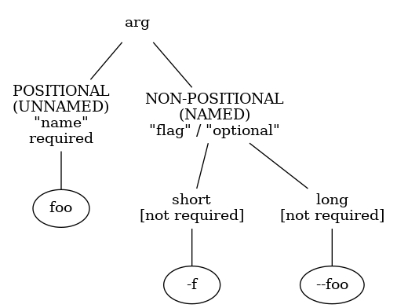

*** Unnamed and named arguments
:PROPERTIES:
:REVEAL_EXTRA_ATTR: data-auto-animate
:END:

#+BEGIN_NOTES
- The method ~add_argument~ must know whether a positional argument or an
  optional argument is being added. 

- What distinguishes a "positional argument" from an "optional argument"?

- The term ``optional argument'' is therefore unfortunate if the 
    the argument is a /required/ argument: In this case, ``optional'' really
    means that the argument is a /required non-positional argument/.

- The terminology is therefore as unfortunate as it is confusing. 
    Optional arguments would perhaps better be referred to as /non-positional/
    arguments.  

- A positional argument is a name like ~foo~. An optional argument
    is a name prefixed by a short arg (something starting with ~-~ ) 
    or a flag (something starting with ~--~ ).  
    We can summarize thus:

    + positional argument :: 
        - occupies a /specific position/ on the command line
        - required argument /ipso facto/
        - has a parser-argument name like ~foo~

    + non-positional argument (a.k.a ``optional'') :: 
        - does /not/ occupy a specific position on the command line 
        - not required by default
        - all optional arguments are prefixed by either ~-~ or ~--~
        - a short arg like ~-f~ or a flag like ~--foo~ 
#+END_NOTES

#+attr_reveal: :data_id add_argument-docs
#+attr_html: :width 15% :align center
#+headers:  :width 800 :height 500 
#+begin_src dot :exports results :results output graphics :file ./img/argparse-names-flags.png :eval no
digraph G {
    edge[arrowhead=none];
    "arg"                               [shape=none];
    "POSITIONAL\n(UNNAMED)\n\"name\"\nrequired"  [shape=none];
    "NON-POSITIONAL\n(NAMED)\n\"flag\" / \"optional\""          [shape=none];
    "short\n[not required]"         [shape=none];
    "long\n[not required]"          [shape=none];

    arg -> "POSITIONAL\n(UNNAMED)\n\"name\"\nrequired" -> "foo";
    arg -> "NON-POSITIONAL\n(NAMED)\n\"flag\" / \"optional\"";

    "NON-POSITIONAL\n(NAMED)\n\"flag\" / \"optional\""-> "short\n[not required]" -> "-f";
    "NON-POSITIONAL\n(NAMED)\n\"flag\" / \"optional\""-> "long\n[not required]"  -> "--foo";
}
#+END_SRC

#+RESULTS:

*** Arguments to ~add_arguments~ 
:PROPERTIES:
:REVEAL_EXTRA_ATTR: data-auto-animate
:END:

#+BEGIN_NOTES
- most of these are self-explanatory
- ~help~ and ~type~ are among the most common
#+END_NOTES

#+attr_reveal: :data_id more-add-args
#+begin_export html 
<pre>
<code class="python" data-line-numbers="-|7,10,12,26,30,32,33">ArgumentParser.add_argument(
    name or flags...
    [, action]
    [, nargs]
    [, const]
    [, default]
    [, type]
    [, choices]
    [, required]
    [, help]
    [, metavar]
    [, dest]
)

Define how a single command-line argument should be parsed. Each parameter
has its own more detailed description below, but in short they are:

name or flags - Either a name or a list of option strings, 
                e.g. foo or -f, --foo.
action        - The basic type of action to be taken when this argument is 
                encountered at the command line.
nargs         - The number of command-line arguments that should be consumed.
const         - A constant value required by some action and nargs selections.
default       - The value produced if the argument is absent from the command line.
type          - The type to which the command-line argument should be converted.
choices       - A container of the allowable values for the argument.
required      - Whether or not the command-line option may be omitted 
                (optionals only).
help          - A brief description of what the argument does.
metavar       - A name for the argument in usage messages.
dest          - The name of the attribute to be added to the object returned 
                by parse_args().
</code>

<code class="R" data-line-numbers="8-12">#!/usr/bin/Rscript --no-init-file

library(argparse)

`square`<- function(args) {
    parser<- ArgumentParser()

    parser$add_argument("-n", "--number", 
        type="integer",
        help="display the square of a given number",
        dest="number_to_square"
    )

    parser$add_argument("-v", "--verbosity", 
        action="count",
        default=0,
        help="increase output verbosity"
    )

    args<-   parser$parse_args(args)
    answer<- args$number_to_square^2

    if (args$verbosity > 2) {
        o<- capture.output(example("^"))

        cat(sprintf("[verbosity level == %d]:\n", args$verbosity))
        cat(sprintf(
            "the square of %d equals %d, using the in-built arithmetic operator '^':\n",
            args$number_to_square, answer
        ))
        cat(sprintf("%s\n", o))
    }
    else if (args$verbosity == 2) {
        cat(sprintf("[verbosity level == %d]:\n", args$verbosity))
        cat(sprintf("the square of %d equals %d\n", args$number_to_square, answer))
    }
    else if (args$verbosity == 1) {
        cat(sprintf("the square of %d is %d\n", args$number_to_square, answer))
    }
    else {
        cat(sprintf("answer = %d\n", answer))
    }
}

square(args=commandArgs(trailingOnly=TRUE))
</code>

</pre>
#+end_export 
#+begin_export html

<small>
<a href="https://docs.python.org/3/library/argparse.html#argparse.ArgumentParser.add_argument"> Python docs: <code>ArgumentParser.add_argument</code></a>
</small>

#+end_export

*** DSL: additional arguments
:PROPERTIES:
:REVEAL_EXTRA_ATTR: data-auto-animate
:END:

#+attr_reveal: :data_id more-add-args
#+begin_export html 
<pre>
<code class="python" data-line-numbers="-|3,4">(
    name or flags...
    [, callback]
    [, local]
    [, action]
    [, nargs]
    [, const]
    [, default]
    [, type]
    [, choices]
    [, required]
    [, help]
    [, metavar]
    [, dest]
)
</code>
</pre>
#+end_export 
#+begin_export html

<small>
<a href="https://github.com/tharte/parsearg"> <code>parsearg</code></a>
</small>

#+end_export

*** DSL: keys
:PROPERTIES:
:REVEAL_EXTRA_ATTR: data-auto-animate
:END:

#+attr_reveal: :data_id more-add-args
#+begin_export html 
<pre><code class="R" data-line-numbers="2,10,18,24">view = list(
    `spark|start|cluster` = list(
        `callback`    = spark_start_cluster,
        `--instance`  = list(
            `help`    =  'Spark cluster instance',
            `default` =  'instance-1',
            `choices` =   c('instance-1', 'instance-2')
        )
    ),
    `spark|stop|cluster` = list(
        `callback`    = spark_stop_cluster,
        `--instance`  = list(
            `help`    =  'Spark cluster instance',
            `default` =  'instance-1',
            `choices` =   c('instance-1', 'instance-2')
        )
    ),
    `hdfs|start` = list(
        `callback`    = hdfs_start,
        `--instance`  = list(
            `help`    =  'Start Hadoop'
        )
    ),
    `hdfs|stop` = list(
        `callback`    = hdfs_stop,
        `--instance`  = list(
            `help`    =  'Stop Hadoop'
        )
    )
)
</code></pre>
#+end_export 

*** DSL: keys
:PROPERTIES:
:REVEAL_EXTRA_ATTR: data-auto-animate
:END:

#+attr_reveal: :data_id essence
#+begin_export html

<small>
    <ul>
        <li class="fragment fade-in"> keys form a <em>flattened</em> tree </li>
            <ul>
                <li class="fragment fade-in">  <code>start|spark|cluster</code> </li>
                <li class="fragment fade-in">  <code>start -> spark -> cluster</code> </li>
            </ul>
        <li class="fragment fade-in"> abstractly </li>
            <ul>
                <li class="fragment fade-in">  <code>A|B|C</code> </li>
                <li class="fragment fade-in">  <code>A -> B -> C</code> </li>
            </ul>
        <li class="fragment fade-in"> neat summary of nested hierarchy of subcommands</li>
        <li class="fragment fade-in"> the magic of <code>parsearg</code> is in unflattening the flat tree into a tree of <code>argparse</code> parsers </li>
    </ul>
</small>

#+end_export

*** DSL: unflattening
:PROPERTIES:
:REVEAL_EXTRA_ATTR: data-auto-animate
:END:

#+attr_reveal: :data_id essence

** UCLI @ Recursion & Trees
*** Heterogeneous trees: recursive data structures
#+begin_export html

<small>
<blockquote class="fragment fade-in" align="left"> An heterogeneous tree is either: </blockquote>
    <ol>
        <li class="fragment fade-in">a value and a set of child trees; or,</li>
        <li class="fragment fade-in">the empty tree.</li>
    </ol>
</small>

#+end_export

*** Trees: Flat & Unflattened
:PROPERTIES:
:REVEAL_EXTRA_ATTR: data-auto-animate
:END:

#+attr_reveal: :data_id flat-tree
#+begin_export html 
<pre><code class="bash" data-line-numbers="3">cmd hdfs stop 
cmd hdfs start 
cmd spark stop cluster --instance=instance-2 --verbose
cmd spark start cluster --instance=instance-1 --quietly
</code></pre>
#+end_export
#+begin_export html 
<pre><code class="python" data-line-numbers="10">view = {
    'spark|start|cluster': {
        'callback':  spark_start_cluster,
        '--instance': {
            'help':     'Spark cluster instance',
            'default':  'instance-1',
            'choices':   ['instance-1', 'instance-2'],
        },
    },
    'spark|stop|cluster': {
        'callback':  spark_stop_cluster,
        '--instance': {
            'help':     'Spark cluster instance',
            'default':  'instance-1',
            'choices':   ['instance-1', 'instance-2'],
        },
    },
    'hdfs|start': {
        'callback':  hdfs_start,
        'help':     'Start Hadoop',
    },
    'hdfs|stop': {
        'callback':  hdfs_stop,
        'help':     'Stop Hadoop',
    },
}
</code></pre>
#+end_export

*** Trees: Flat & Unflattened
:PROPERTIES:
:REVEAL_EXTRA_ATTR: data-auto-animate
:END:

#+attr_reveal: :data_id flat-tree
#+attr_html: :width 15% :align center
#+headers:  :width 800 :height 500 
#+begin_src dot :exports results :results output graphics :file ./img/spark-hdfs-tree-1.png
digraph G {
    subgraph {
    edge [penwidth=0.5; arrowsize=0.65, arrowhead=normal];
        root [label="root"shape=none];
        Rootopt[label="", shape=none];
        spark   [shape=none];
        hdfs  [shape=none];
        start1 [label="start"; shape=none];
        cluster1 [label="cluster"; shape=none];
        cluster2 [label="cluster"; shape=none];
        stop1 [label="stop"; shape=none];
        start2 [label="start"; shape=none];
        stop2 [label="stop"; shape=none];

	root -> spark;
	root -> hdfs;

	spark -> start1;
	spark -> stop1;
	start1 -> cluster1;
	stop1 -> cluster2;

	hdfs -> start2;
	hdfs -> stop2
    }
}
#+END_SRC

#+RESULTS:
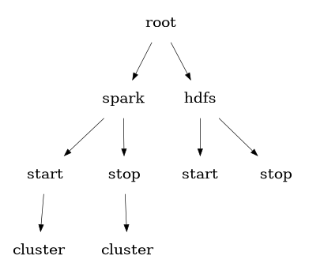

*** Trees: Flat & Unflattened
:PROPERTIES:
:REVEAL_EXTRA_ATTR: data-auto-animate
:END:

#+attr_reveal: :data_id flat-tree
#+attr_html: :width 15% :align center
#+headers:  :width 800 :height 500 
#+begin_src dot :exports results :results output graphics :file ./img/spark-hdfs-tree-2.png
digraph G {
    subgraph {
    edge [penwidth=0.5; arrowsize=0.65, arrowhead=normal];
        root [label="root"shape=none];
        Rootopt[label="", shape=none];
        spark1   [label="spark"; shape=none];
        hdfs1   [label="hdfs"; shape=none];
        spark2   [label="spark"; shape=none];
        hdfs2   [label="hdfs"; shape=none];
        start [label="start"; shape=none];
        cluster [label="cluster"; shape=none];
        stop [label="stop"; shape=none];
        start [label="start"; shape=none];

	root -> cluster;
	cluster -> start;
	cluster -> stop;

	start -> hdfs1;
	start -> spark1;

	stop -> hdfs2;
	stop -> spark2;
    }
}
#+END_SRC

#+RESULTS:
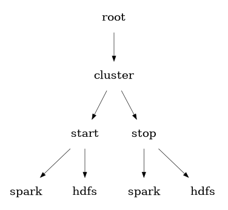

*** Trees: Flat & Unflattened
:PROPERTIES:
:REVEAL_EXTRA_ATTR: data-auto-animate
:END:

#+attr_reveal: :data_id flat-tree
#+begin_export html 
<pre><code class="bash" data-line-numbers="3">cmd cluster stop hdfs
cmd cluster start hdfs 
cmd cluster stop spark --instance=instance-2 --verbose
cmd cluster start spark --instance=instance-1 --quietly
</code></pre>
#+end_export
#+begin_export html 
<pre><code class="python" data-line-numbers="10">view = {
    'cluster|start|spark': {
        'callback':  spark_start_cluster,
        '--instance': {
            'help':     'Spark cluster instance',
            'default':  'instance-1',
            'choices':   ['instance-1', 'instance-2'],
        },
    },
    'cluster|stop|spark': {
        'callback':  spark_stop_cluster,
        '--instance': {
            'help':     'Spark cluster instance',
            'default':  'instance-1',
            'choices':   ['instance-1', 'instance-2'],
        },
    },
    'cluster|start|hdfs': {
        'callback':  hdfs_start,
        'help':     'Start Hadoop',
    },
    'cluster|stop|hdfs': {
        'callback':  hdfs_stop,
        'help':     'Stop Hadoop',
    },
}
</code></pre>
#+end_export

*** Trees: longhand
:PROPERTIES:
:REVEAL_EXTRA_ATTR: data-auto-animate
:END:

#+attr_reveal: :data_id a-tree
#+attr_html: :width 15% :align center
#+headers:  :width 800 :height 500 
#+headers:  :width 800 :height 500 
#+begin_src dot :exports results :results output graphics :file ./img/a-tree.png
digraph G {
    subgraph {
    edge [penwidth=0.5; arrowsize=0.65, arrowhead=normal];
        A   [label="A"shape=none];
        Aopt[label="", shape=none];
        B   [shape=none];
        BB  [shape=none];
        BBB [shape=none];
        BBopt[label="", shape=none];
        C   [shape=none];
        CC  [shape=none];
        CCC [shape=none];

	A -> B;
	A -> BB;
	A -> BBB;
	BB -> C;
	BB -> CC;
	BB -> CCC;
    }
}
#+END_SRC

#+RESULTS:
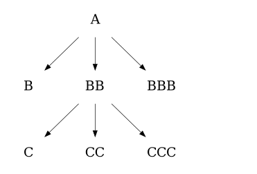

*** Trees: longhand
:PROPERTIES:
:REVEAL_EXTRA_ATTR: data-auto-animate
:END:

#+attr_reveal: :data_id a-tree
#+attr_html: :width 15% :align center
#+headers:  :width 800 :height 500 
#+headers:  :width 800 :height 500 
#+begin_src dot :exports results :results output graphics :file ./img/aa-tree.png
digraph G {
    subgraph {
    edge [penwidth=0.5; arrowsize=0.65];
        root [label="root"; shape=none];
        A    [shape=none];
        AA   [shape=none];
        Aopt [label="", shape=none];
        AAopt [label="", shape=none];
        B1   [label="B";   shape=none];
        BB1  [label="BB";  shape=none];
        BBB1 [label="BBB"; shape=none];
        C1opt [label="";   shape=none];
        C1   [label="C";   shape=none];
        CC1  [label="CC";  shape=none];
        CCC1 [label="CCC";  shape=none];
        B2   [label="B";   shape=none];
        BB2  [label="BB";  shape=none];
        BBB2 [label="BBB"; shape=none];
        C2opt [label="";   shape=none];
        C2   [label="C";   shape=none];
        CC2  [label="CC";  shape=none];
        CCC2 [label="CCC";  shape=none];

	root -> A;
	root -> AA;
	A -> B1;
	A -> BB1;
	A -> BBB1;
	BB1 -> C1;
	BB1 -> CC1;
	BB1 -> CCC1;

	AA -> B2;
	AA -> BB2;
	AA -> BBB2;
	BB2 -> C2;
	BB2 -> CC2;
	BB2 -> CCC2;
    }
}
#+END_SRC

#+RESULTS:
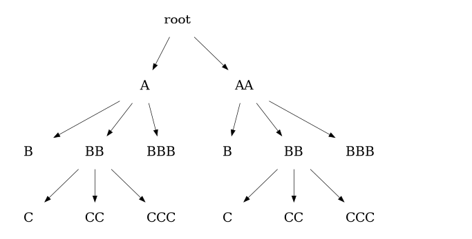

*** Trees: longhand
:PROPERTIES:
:REVEAL_EXTRA_ATTR: data-auto-animate
:END:

#+attr_reveal: :data_id a-tree
#+begin_export html 
<pre><code class="python" data-line-numbers="2-6|11-19|21">"""
       A
     / | \
    B  BB BBB
      /| \
     C CC CCC
"""

from parsearg.data_structures import Tree, Node, Key

tree = Tree('A', children=[
    Tree('B', []),
    Tree('BB', children=[
        Tree('C', []),
        Tree('CC', []),
        Tree('CCC', [])
    ]),
    Tree('BBB', []),
])

print(tree.show(quiet=True))
</code></pre>
#+end_export
#+begin_export html
<pre class="example fragment fade-in">
A
    B
    BB
        C
        CC
        CCC
    BBB
</pre>
#+end_export 

*** Trees: longhand
:PROPERTIES:
:REVEAL_EXTRA_ATTR: data-auto-animate
:END:

#+attr_reveal: :data_id a-tree
#+begin_export html 
<pre><code class="R" data-line-numbers="-|52-60|56|28-50|44|34-41|38-40">`Tree`<- function(value=NULL, children=NULL) {
    value<-    force(value)
    children<- force(children)
    if (is.null(children))
        children<- list()

    .Value<- function(name=NULL, key=NULL, d=NULL) {
        `check`<- function(x) {
            if (!is.null(x))
                assert(class(x)=="character")
        }
        check(name)
        check(key)
        if (!is.null(d)) {
            assert(
                class(d)=="list",
                !is.null(key)
            )
            payload=d[[key]]
        }

        list(
            name=name,
            key=key,
            payload=d
        )
    }
    .show<- function(level=0, indent = '\t', quiet=FALSE) {
        `.is_empty`<- function(tree) {
            is.null(tree$value) && length(tree$children) == 0
        }

        o<- list()
        `.show`<- function(tree, level, indent) {
            # depth-first search (DFS)
            if (.is_empty(tree)) return
            o<<- c(o, sprintf("%s%s", strrep(indent, level), tree$value))
            for (child in tree$children) {
                .show(child, level=level+1, indent=indent)
            }
        }

        self<- Tree(value, children)
        .show(self, level, indent)
        o = paste0(paste0(o, collapse='\n'), "\n")

        if (!quiet) print(o)

        o
    }

    structure(
        list(
            `value`    = value,
            `children` = children,
            `show`     = .show,
            `Value`    = .Value
        ),
        class="Tree"
    )
}
</code></pre>
#+end_export

*** Trees: longhand
:PROPERTIES:
:REVEAL_EXTRA_ATTR: data-auto-animate
:END:

#+attr_reveal: :data_id a-tree
#+begin_export html 
<pre><code class="R" data-line-numbers="">Tree('A', children=list(
    Tree('B'),
    Tree('BB', children=list(
        Tree('C'),
        Tree('CC'),
        Tree('CCC')
    )),
    Tree('BBB')
))$show(quiet=TRUE, indent="    ") %>% cat
</code></pre>
#+end_export
#+begin_export html
<pre class="example fragment fade-in">
A
    B
    BB
        C
        CC
        CCC
    BBB
</pre>
#+end_export 

*** Trees: shorthand
:PROPERTIES:
:REVEAL_EXTRA_ATTR: data-auto-animate
:END:

#+attr_reveal: :data_id short-hand
#+begin_export html 
<pre class="fragment fade-in"><code class="R" data-line-numbers="">list(
    'A',
    'A|B',
    'A|BB',
    'A|BB|C',
    'A|BB|CC',
    'A|BB|CCC',
    'A|BBB'
)
</code></pre>
#+end_export
#+attr_reveal: :frag (appear)

*** Trees: shorthand
:PROPERTIES:
:REVEAL_EXTRA_ATTR: data-auto-animate
:END:

#+attr_reveal: :data_id short-hand
Non-terminating nodes:
#+begin_export html 
<pre class="fragment fade-in"><code class="R" data-line-numbers="">c(
    'A',
    'A|BB'
)
</code></pre>
#+end_export
Terminating nodes (leaves):
#+begin_export html 
<pre class="fragment fade-in"><code class="R" data-line-numbers="">c(
    'A|B',
    'A|BB|C',
    'A|BB|CC',
    'A|BB|CCC',
    'A|BBB'
)
</code></pre>
#+end_export
#+attr_html: :width 25% :align center

*** Trees: longhand/shorthand 
:PROPERTIES:
:REVEAL_EXTRA_ATTR: data-auto-animate
:END:

#+attr_reveal: :data_id duality
#+begin_export html

<small>

There is a duality here:

    <ol>
        <li class="fragment fade-in">we need a shorthand in order for the tree's structure to be specified in a simple way (the "flattened" shorthand); and</li>
        <li class="fragment fade-in">we need to make use of the structure of the tree itself (the "unflattened" tree).</li>
    </ol>
</small>

#+end_export

*** Trees: longhand/shorthand 
:PROPERTIES:
:REVEAL_EXTRA_ATTR: data-auto-animate
:END:

#+attr_reveal: :data_id duality
#+begin_export html

<small>

<code>parsearg</code> transforms a <code>list</code>,
representing the tree's nodes, into a <code>Tree</code>:

    <ul>
        <li class="fragment fade-in">the <code>names</code> of the <code>list</code> are shorthand for the tree's nodes and the values of the <code>list</code> are the nodes' payloads;</li>
        <li class="fragment fade-in">we need the shorthand of the <code>list</code> for ease of specification;</li>
        <li class="fragment fade-in">and we need the <code>Tree</code> to avail of the data structure's properties.</li>
    </ul>
</small>

#+end_export

** UCLI @ Declarative
*** Data, not actions
#+begin_export html

<small>

Putting together a CLI with <code>argparse</code>
alone is nothing if not an exercise in imperative programming, and this
has negative consequences:

    <ol>
        <li class="fragment fade-in">it obfuscates the intention of the CLI design;</li>
        <li class="fragment fade-in">it is prone to errors;</li>
        <li class="fragment fade-in">it discourages CLI design in the first instance;</li>
        <li class="fragment fade-in">it makes debugging a CLI design very difficult; and </li>
        <li class="fragment fade-in">it makes refactoring or re-configuring the CLI design overly burdensome.</li>
    </ol>
</small>

#+end_export
*** A /concrete/ abstract tree
:PROPERTIES:
:REVEAL_EXTRA_ATTR: data-auto-animate
:END:

#+attr_reveal: :data_id real-abstract-tree
#+begin_export html 
<pre><code class="bash" data-line-numbers="3">cmd A BB CCC -c -v
cmd A B -c -v
cmd A B -c --verbose
</code></pre>
#+end_export
#+begin_export html 
<pre><code class="R" data-line-numbers="1,37|7-11">view = list(
    `A` = list(
        `callback` =     make_callback('A'),
        `-c` =           list(`help` = 'A [optional pi]', `action` = 'store_const', `const` = 3.141593),
        `-v|--verbose` = list(`help` = 'A verbosity', `action` = 'store_true')
    ),
    `A|B` = list(
        `callback` =     make_callback('A_B'),
        `-c` =           list(`help` = 'A B [optional pi]', `action` = 'store_const', `const` = 3.141593),
        `-v|--verbose` = list(`help` = 'A B verbosity', `action` = 'store_true')
    ),
    `A|BB` = list(
        `callback` =     make_callback('A_BB'),
        `-c` =           list(`help` = 'A BB [optional pi]', `action` = 'store_const', `const` = 3.141593),
        `-v|--verbose` = list(`help` = 'A BB erbosity', `action` = 'store_true')
    ),
    `A|BB|C` = list(
        `callback` =     make_callback('A_BB_C'),
        `-c` =           list(`help` = 'A BB C [optional pi]', `action` = 'store_const', `const` = 3.141593),
        `-v|--verbose` = list(`help` = 'A BB C verbosity', `action` = 'store_true')
    ),
    `A|BB|CC` = list(
        `callback` =     make_callback('A_BB_CC'),
        `-c` =           list(`help` = 'A BB CC [optional pi]', `action` = 'store_const', `const` = 3.141593),
        `-v|--verbose` = list(`help` = 'A BB CC verbosity', `action` = 'store_true')
    ),
    `A|BB|CCC` = list(
        `callback` =     make_callback('A_BB_CCC'),
        `-c` =           list(`help` = 'A BB CCC [optional pi]', `action` = 'store_const', `const` = 3.141593),
        `-v|--verbose` = list(`help` = 'A BB CCC verbosity', `action` = 'store_true')
    ),
    `A|BBB` = list(
        `callback` =     make_callback('A_BBB'),
        `-c` =           list(`help` = 'A BBB [optional pi]', `action` = 'store_const', `const` = 3.141593),
        `-v|--verbose` = list(`help` = 'A BBB verbosity', `action` = 'store_true')
    )
)
</code></pre>
#+end_export

** UCLI @ MVC
*** Separation of concerns
:PROPERTIES:
:REVEAL_EXTRA_ATTR: data-auto-animate
:END:

#+attr_reveal: :data_id mvc
#+begin_export html

<small>

<code>argparse</code> has everything we need in terms of <em>functionality</em>;
it's just clunky to use

</small>

#+end_export
*** Separation of concerns
:PROPERTIES:
:REVEAL_EXTRA_ATTR: data-auto-animate
:END:

#+attr_reveal: :data_id mvc
#+begin_export html

<small>

<code>parsearg</code> 
is a layer
over <code>argparse</code> that exposes <code>argparse</code>'s functionality via
a <code>list</code>:

    <ol>
        <li class="fragment fade-in">the <code>list</code> is the <em>View</em> component of the <a href="https://en.wikipedia.org/wiki/Model%E2%80%93view%E2%80%93controller"><strong>Model-View-Controller ("MVC")</strong></a><design pattern;</li>
        <li class="fragment fade-in">the <code>list</code> embeds callbacks from the <em>Controller</em> component, achieving a clean separation of duties;</li>
        <li class="fragment fade-in">by separating the View component into a <code>dict</code>, the CLI design can be expressed in a <em>declarative</em> way.</li>
    </ol>
</small>

#+end_export

*** Separation of concerns
:PROPERTIES:
:REVEAL_EXTRA_ATTR: data-auto-animate
:END:

#+attr_reveal: :data_id mvc
#+begin_export html

<small>

<code>parsearg</code> manifests the <em>intention</em>
of the CLI design without having to specify how that design is implemented
in terms of <code>argparse</code>'s parsers and subparsers
(<code>parsearg</code> does that for you)

</small>

#+end_export

* ~parsearg~
** How does it work?
*** Helper functions: ~Key~
:PROPERTIES:
:REVEAL_EXTRA_ATTR: data-auto-animate
:END:

#+attr_reveal: :data_id helpers
#+begin_export html 
<pre><code class="python" data-line-numbers="1|2"># 1. take key
key = 'A|B|C'</code></pre>
#+end_export

*** Helper functions: ~Key~
:PROPERTIES:
:REVEAL_EXTRA_ATTR: data-auto-animate
:END:

#+attr_reveal: :data_id helpers
#+begin_export html 
<pre><code class="python" data-line-numbers="1|3"># 2. split string
sep = '|'
print( Key.split(key) )
</code></pre>
#+end_export
#+begin_export html
<pre class="example fragment fade-in"> ['A', '|', 'B', '|', 'C']
</pre>
#+end_export 

*** Helper functions: ~Key~
:PROPERTIES:
:REVEAL_EXTRA_ATTR: data-auto-animate
:END:

#+attr_reveal: :data_id helpers
#+begin_export html 
<pre><code class="python" data-line-numbers="1|2"># 3. unflatten the split key (i.e. create a nested list)
unflattened = Key.unflatten(Key.split(key))
print(unflattened)
</code></pre>
#+end_export
#+begin_export html
<pre class="example fragment fade-in">
['A', ['B', ['C']]]
</pre>
#+end_export 

*** Helper functions: ~Node~
:PROPERTIES:
:REVEAL_EXTRA_ATTR: data-auto-animate
:END:

#+attr_reveal: :data_id helpers
#+begin_export html 
<pre><code class="python" data-line-numbers="1|2"># 4. create a Node from the unflattened list
node = Node.from_nested_list(unflattened)
print(node)</code></pre>
#+end_export
#+begin_export html
<pre class="example fragment fade-in">
('A', ['B', ['C']])
</pre>
#+end_export 

*** Helper functions: ~Node~
:PROPERTIES:
:REVEAL_EXTRA_ATTR: data-auto-animate
:END:

#+attr_reveal: :data_id helpers
#+begin_export html 
<pre><code class="python" data-line-numbers="1|2|3|4|5"># 5. the node can now be shifted until the empty node is reached
print(node << 0)
print(node << 1)
print(node << 2)
print(node << 3)
</code></pre>
#+end_export
#+begin_export html
<pre class="example fragment fade-in">('A', ['B', ['C']])
('B', ['C'])
('C', [])
(None, [])
</pre>
#+end_export 

*** Helper functions: ~Key~ to ~Node~
:PROPERTIES:
:REVEAL_EXTRA_ATTR: data-auto-animate
:END:

#+attr_reveal: :data_id helpers
#+begin_export html 
<pre><code class="python" data-line-numbers="1|2">print( key )
print( Key.to_node(key) )
</code></pre>
#+end_export
#+begin_export html
<pre class="example fragment fade-in">
A|B|C
('A', ['B', ['C']])
</pre>
#+end_export 

*** Helper functions: What does a ~Node~ do? 
:PROPERTIES:
:REVEAL_EXTRA_ATTR: data-auto-animate
:END:

#+begin_notes
- A Node is really a convenient way to view the key.
- Shifting the Node until it is empty provides a convenient way
  to determine when a leaf node has been reached:
- A Key just keeps track of the node’s payload and the key itself while
  this iteration is performed over all nodes at a particular level of the flat tree.
#+end_notes

#+attr_reveal: :data_id helpers
#+begin_export html 
<pre><code class="python" data-line-numbers="1|2|4-6|7-8">key = 'A|B|C'
n = Key.to_node(key) 
i = 0
while not n.is_empty():
    i += 1
    n = node << i
    
print(i)
print(node << i)
</code></pre>
#+end_export
#+begin_export html
<pre class="example fragment fade-in">3
(None, [])
</pre>
#+end_export 

*** Helper functions: Track a payload
:PROPERTIES:
:REVEAL_EXTRA_ATTR: data-auto-animate
:END:

#+begin_notes
- take a leaf node
- the ~Key~ stores the following:
  1. the key itself 
  1. the ~dict~ associated with the key, if any
- the ~Node~, which is a representation of the key’s delimited string as a nested list
- the ~payload~
#+end_notes

#+attr_reveal: :data_id helpers
#+begin_export html 
<pre><code class="python" data-line-numbers="1">print( Key(key).key )
</code></pre>
#+end_export
#+begin_export html
<pre class="example fragment fade-in">
A|B|C
</pre>
#+end_export 

*** Helper functions: Track a payload
:PROPERTIES:
:REVEAL_EXTRA_ATTR: data-auto-animate
:END:

#+begin_notes
- take a leaf node
- the ~Key~ stores the following:
  1. the key itself 
  1. the ~dict~ associated with the key, if any
- the ~Node~, which is a representation of the key’s delimited string as a nested list
- the ~payload~
#+end_notes

#+attr_reveal: :data_id helpers
#+begin_export html 
<pre><code class="python" data-line-numbers="1|2|3">payload = 3.141593
d = {key: payload}
print( Key(key, d=d).d )
</code></pre>
#+end_export
#+begin_export html
<pre class="example fragment fade-in">{'A|BB|C': 3.141593}
</pre>
#+end_export 

*** Helper functions: Track a payload
:PROPERTIES:
:REVEAL_EXTRA_ATTR: data-auto-animate
:END:

#+begin_notes
- take a leaf node
- the ~Key~ stores the following:
  1. the key itself 
  1. the ~dict~ associated with the key, if any
- the ~Node~, which is a representation of the key’s delimited string as a nested list
- the ~payload~
#+end_notes

#+attr_reveal: :data_id helpers
#+begin_export html 
<pre><code class="python" data-line-numbers="1|2|3">print( Key(key).value )
print( type(Key(key).value) )
</code></pre>
#+end_export
#+begin_export html
<pre class="example fragment fade-in">('A', ['BB', ['C']])
<class 'parsearg.data_structures.Node'>
</pre>
#+end_export 

*** Helper functions: Track a payload
:PROPERTIES:
:REVEAL_EXTRA_ATTR: data-auto-animate
:END:

#+begin_notes
- take a leaf node
- the ~Key~ stores the following:
  1. the key itself 
  1. the ~dict~ associated with the key, if any
- the ~Node~, which is a representation of the key’s delimited string as a nested list
- the ~payload~
#+end_notes

#+attr_reveal: :data_id helpers
#+begin_export html 
<pre><code class="python" data-line-numbers="1|2|3">payload = 3.141593
d = {key: payload}
print( Key(key, d).payload )
</code></pre>
#+end_export
#+begin_export html
<pre class="example fragment fade-in">3.141593
</pre>
#+end_export 

*** Helper functions: Shifting a ~Key~
:PROPERTIES:
:REVEAL_EXTRA_ATTR: data-auto-animate
:END:

#+begin_notes
- take a leaf node
- the ~Key~ stores the following:
  1. the key itself 
  1. the ~dict~ associated with the key, if any
- the ~Node~, which is a representation of the key’s delimited string as a nested list
- the ~payload~
#+end_notes

#+attr_reveal: :data_id helpers
#+begin_export html 
<pre><code class="python" data-line-numbers="">print( Key(key) )
# same thing:
print( Key(key) << 0 )
# real shifts:
print( Key(key) << 1 )
print( Key(key) << 2 )
print( Key(key) << 3 )
# same thing:
print( Key(key) << 4 )
</code></pre>
#+end_export
#+begin_export html
<pre class="example fragment fade-in">'A|BB|C': ('A', ['BB', ['C']])
'A|BB|C': ('A', ['BB', ['C']])
'A|BB|C': ('BB', ['C'])
'A|BB|C': ('C', [])
'A|BB|C': (None, [])
'A|BB|C': (None, [])
</pre>
#+end_export 

*** ~parsearg~: The Guts
#+begin_export html 
<pre><code class="python" data-line-numbers="16|19-22|20|62-115|66-67|110-113|69|22|28-60">import sys
import argparse
from parsearg.data_structures import (
    is_empty,
    Tree,
    Key,
)
from parsearg.utils import (
    is_valid,
    print_list,
    is_list_of,
)

class ParseArg:
    def __init__(self, d, root_name='root'):
        assert isinstance(d, dict) and is_valid(d)

        self.d       = d
        self.tree    = ParseArg.to_tree(self.d, root_name=root_name)
        self.parser  = argparse.ArgumentParser(add_help=True)
        ParseArg.make_subparsers(self.tree, self.parser)

    def parse_args(self, args):
        args   = args.split() if isinstance(args, str) else args
        return self.parser.parse_args(args)

    @staticmethod
    def make_subparsers(tree, parser):
        def argparse_argument_name_or_flags(keys):
            keys = keys.split('|')
            keys = list(map(lambda x: x.strip(' \t\n\r'), keys))

            return keys

        def make_parser(node, subparsers):
            assert type(node.value) == Tree.Value
            parser = subparsers.add_parser(node.value.name)

            # print(f'node = {node.value}')
            if node.value.payload is not None:
                for key, value in node.value.payload.items():
                    if key == 'callback':
                        parser.set_defaults(
                            callback=value
                        )
                    else:
                        parser.add_argument(
                            *argparse_argument_name_or_flags(key), **value
                        )

            if len(node.children):
                subparsers = parser.add_subparsers()
                for child in node.children:
                    make_parser(child, subparsers)

        if not tree.is_empty():
            subparsers = parser.add_subparsers()
            for child in tree.children:
                make_parser(child, subparsers)

    @staticmethod
    def to_tree(d, root_name='root'):
        assert isinstance(d, dict)

        nodes = map(lambda key: Key(key), d.keys())
        nodes = list(filter(lambda x: not x.is_empty(), nodes))

        def _to_tree(x):
            if isinstance(x, list) and len(x)==1 and x[0].is_leaf():
                x = x[0]

                return Tree(
                    Tree.Value(name=x.value.head(), key=x.key, d=d)
                )

            else:
                name = set(map(lambda x: x.value.head(), x))
                assert len(name)==1
                name = name.pop()

                o       = []
                shifted = list(map(lambda x: x << 1, x))

                # optional arguments added to node itself
                tree = None
                empty   = list(filter(lambda x: x.is_empty(), shifted))
                assert len(empty) <= 1
                if len(empty):
                    x = empty[0]
                    tree = Tree(
                        Tree.Value(name = name, key=x.key, d=d)
                    )

                # arguments added to child nodes
                children    = list(filter(lambda x: not x.is_empty(), shifted))
                child_names = set(map(lambda x: x.value.head(), children))

                for child_name in child_names:
                    child = list(filter(lambda x: x.value.head() == child_name, children))
                    o    += [_to_tree(child)]

                if tree is not None:
                    tree.children = o 
                else:
                    tree = Tree(Tree.Value(name=name, key=None), children=o)

                return tree

        o = []
        for name in set(map(lambda x: x.value.head(), nodes)):
            node = list(filter(lambda x: x.value.head()==name, nodes))
            o += [_to_tree(node)]

        return Tree(root_name, children=o)
</code></pre>
#+end_export

** Python: Complete Program
#+begin_export html 
<pre><code class="python" data-line-numbers="|2|4,5,8,9|12,37|13,21,29,33|14,22,30,34|15,23,31,35|40|41|42">import sys
from parsearg import ParseArg
from spark import (
    spark_start_cluster,
    spark_stop_cluster,
)
from hdfs import (
    hdfs_start,
    hdfs_stop,
)

view = {
    'spark|start': {
        'callback':  spark_start_cluster,
        '--instance': {
            'help':     'Spark cluster instance',
            'default':  'instance-1',
            'choices':   ['instance-1', 'instance-2'],
        },
    },
    'spark|stop': {
        'callback':  spark_stop_cluster,
        '--instance': {
            'help':     'Spark cluster instance',
            'default':  'instance-1',
            'choices':   ['instance-1', 'instance-2'],
        },
    },
    'hdfs|start': {
        'callback':  hdfs_start,
        'help':     'Start Hadoop',
    },
    'hdfs|stop': {
        'callback':  hdfs_stop,
        'help':     'Stop Hadoop',
    },
}

def main(args: list)-> None:
    parser = ParseArg(view)
    ns     = parser.parse_args(args)
    result = ns.callback(ns)

if __name__ == "__main__":
    args = sys.argv[1:] if len(sys.argv) > 1 else []
    main(' '.join(args))
</code></pre>
#+end_export

** R: Complete Program
#+begin_export html 
<pre><code class="R" data-line-numbers="|1|3|5,7,9,11|6,8,10,12|16,24,32,38|45|46|47|48|50"> #!/usr/bin/Rscript --no-init-file

suppressPackageStartupMessages(library(parsearg))

`spark_start_cluster`<- function(args) 
    cat(sprintf("starting Spark cluster instance=%s", args.instance)),
`spark_stop_cluster`<- function(args) 
    cat(sprintf("stopping Spark cluster instance=%s", args.instance)),
`hdfs_start`<- function(args) 
    cat(sprintf("starting HDFS cluster instance=%s", args.instance)),
`hdfs_stop`<- function(args) 
    cat(sprintf("stopping HDFS cluster instance=%s", args.instance)),

view = list(
    `spark|start|cluster` = list(
        `callback`    = spark_start_cluster,
        `--instance`  = list(
            `help`    =  'Spark cluster instance',
            `default` =  'instance-1',
            `choices` =   c('instance-1', 'instance-2')
        )
    ),
    `spark|stop|cluster` = list(
        `callback`    = spark_stop_cluster,
        `--instance`  = list(
            `help`    =  'Spark cluster instance',
            `default` =  'instance-1',
            `choices` =   c('instance-1', 'instance-2')
        )
    ),
    `hdfs|start` = list(
        `callback`    = hdfs_start,
        `--instance`  = list(
            `help`    =  'Start Hadoop'
        )
    ),
    `hdfs|stop` = list(
        `callback`    = hdfs_stop,
        `--instance`  = list(
            `help`    =  'Stop Hadoop'
        )
    )
)

`main`<- function(args=commandArgs(trailingOnly=TRUE)) {
    parser<- ParseArg(view)
    ns<-     parser$parse_args(args)
    result<- ns$callback(ns)
}
main()
</code></pre>
#+end_export

* Parting thought
#+begin_export html

<small>

"We are tech cockroaches...
 

When the next technology apocalypse comes, we'll be the only ones to survive!"

 
 
Michael Kane (Parlor West Loop, Chicago, 2022-06-03)

</small>

#+end_export
